# GitHub Spec-Kit Comprehensive Technical Guide

> **A complete technical reference for Spec-Driven Development (SDD) using GitHub Spec-Kit. This document contains exhaustive details, advanced patterns, and in-depth explanations for developers who want to master every aspect of the toolkit.**

---

## Table of Contents

1. [Introduction & Philosophy](#introduction--philosophy)
2. [System Architecture](#system-architecture)
3. [Installation & Configuration](#installation--configuration)
4. [Official Spec-Kit Workflow](#official-spec-kit-workflow)
5. [Core Commands Deep Dive](#core-commands-deep-dive)
6. [Brownfield Project Integration](#brownfield-project-integration)
7. [Constitutional Governance Framework](#constitutional-governance-framework)
8. [Advanced Workflow Patterns](#advanced-workflow-patterns)
9. [Template Customization](#template-customization)
10. [Error Recovery & Debugging](#error-recovery--debugging)
11. [Multi-Agent Strategies](#multi-agent-strategies)
12. [CI/CD Integration](#cicd-integration)
13. [Performance & Optimization](#performance--optimization)
14. [Troubleshooting Reference](#troubleshooting-reference)
15. [Best Practices & Patterns](#best-practices--patterns)

---

## Introduction & Philosophy

### What is Spec-Driven Development?

Spec-Driven Development (SDD) is a methodology that inverts traditional software development by making **specifications—not code—the primary artifact**. Code becomes the expression of those specifications rather than the source of truth.

### Core Principles

1. **Specifications First**: Every feature begins with a detailed specification that defines WHAT and WHY
2. **Executable Specifications**: Specs are not static documents but active artifacts that drive development
3. **Constitutional Governance**: Architectural principles are enforced through automated validation
4. **Test-Driven Implementation**: All code follows TDD principles with real integration tests
5. **Incremental Development**: Features are built through small, validated steps

### The Spec-Kit Ecosystem

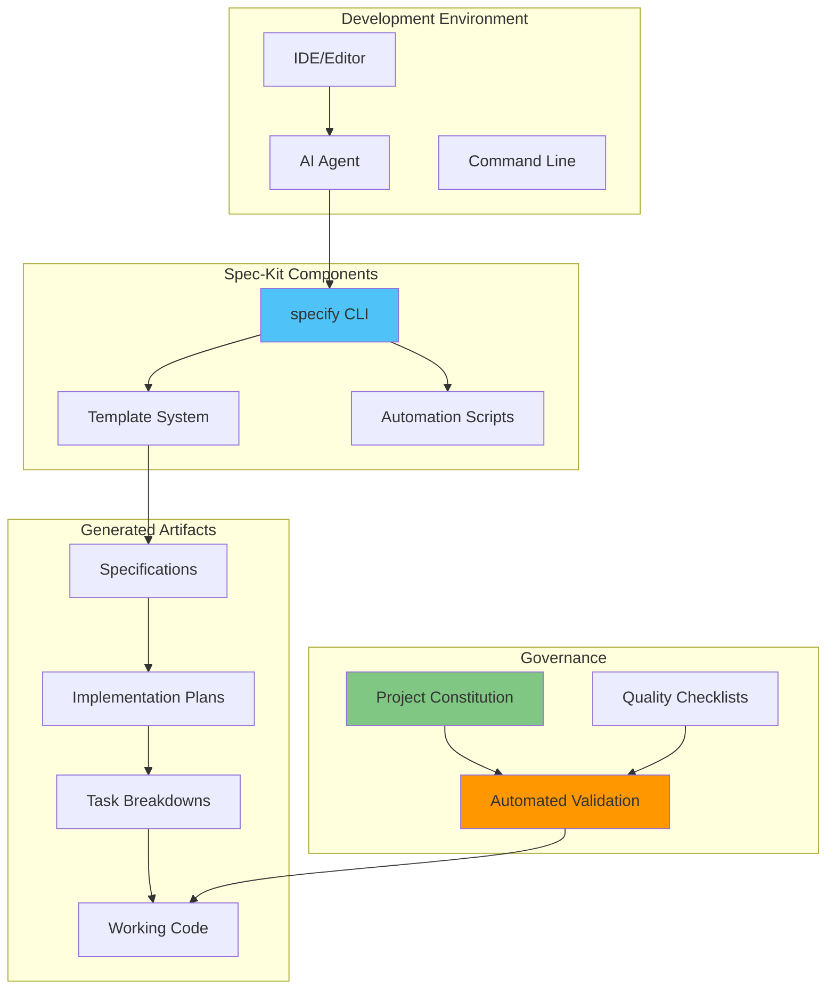

---

## System Architecture

### Three-Tier Architecture

#### Tier 1: Bootstrap Layer
- **Package Management**: `uv` for Python package distribution
- **CLI Installation**: `uv tool install specify-cli`
- **Project Initialization**: `specify init` command
- **Template Download**: Fetches latest templates from repository
- **Git Repository Setup**: Initializes proper branching structure

#### Tier 2: Execution Layer
- **Command System**: 8 core speckit commands for workflow management
- **Shell Scripts**: Cross-platform automation (bash/PowerShell)
- **Agent Context Management**: Dynamic context file updates
- **Artifact Generation**: Creates structured documentation
- **Git Integration**: Automatic branching and commits

#### Tier 3: Governance Layer
- **Constitution Management**: Nine Articles of Development
- **Template Constraints**: Enforces consistent structure
- **Quality Gates**: Pre-implementation validation
- **Checklist Generation**: Dynamic quality checks
- **Compliance Checking**: Automated rule enforcement

### Supported AI Agents & Integration

Spec-Kit supports 15+ AI agents with automatic configuration:

| Agent | CLI Flag | Directory | File Format | Context File |
|-------|----------|-----------|-------------|--------------|
| Claude Code | `--ai claude` | `.claude/commands/` | `.md` | `CLAUDE.md` |
| Gemini CLI | `--ai gemini` | `.gemini/commands/` | `.toml` | `GEMINI.md` |
| GitHub Copilot | `--ai copilot` | `.github/prompts/` | `.prompt.md` | `.github/copilot-instructions.md` |
| Cursor Agent | `--ai cursor-agent` | `.cursor/rules/` | `.mdc` | `.cursor/rules/specify-rules.mdc` |
| Windsurf | `--ai windsurf` | `.windsurf/rules/` | `.md` | `.windsurf/rules/specify-rules.md` |
| Qwen | `--ai qwen` | `.qwen/commands/` | `.toml` | `QWEN.md` |
| OpenCode | `--ai opencode` | `.opencode/commands/` | `.md` | `OPENCODE.md` |
| CodeX | `--ai codex` | `.codex/commands/` | `.md` | `CODEX.md` |
| KiloCode | `--ai kilocode` | `.kilocode/commands/` | `.md` | `KILOCODE.md` |
| Auggie | `--ai auggie` | `.auggie/commands/` | `.md` | `AUGGIE.md` |
| Roo | `--ai roo` | `.roo/commands/` | `.md` | `ROO.md` |
| CodeBuddy | `--ai codebuddy` | `.codebuddy/commands/` | `.md` | `CODEBUDDY.md` |
| Amp | `--ai amp` | `.amp/commands/` | `.md` | `AMP.md` |
| Q | `--ai q` | `.q/commands/` | `.md` | `Q.md` |

### Available CLI Commands

```bash
specify init      # Initialize project
specify check     # Check environment
specify git       # Git operations
specify claude    # Claude setup
specify gemini    # Gemini setup
specify code      # VS Code setup
specify code-insiders  # VS Code Insiders setup
specify cursor-agent   # Cursor setup
specify windsurf  # Windsurf setup
# ... and more for each supported agent
```

### Component Interaction

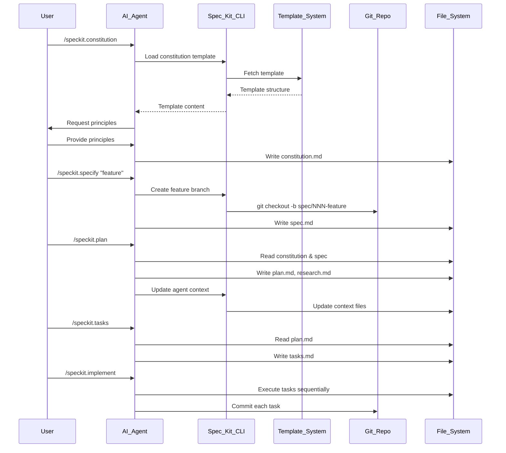

---

## Installation & Configuration

### Prerequisites Verification

```bash
# Check for uv installation
uv --version || echo "uv not installed"

# Verify Git installation  
git --version

# Verify AI agent installation
# Claude: claude --version
# Cursor: cursor --version
# Windsurf: windsurf --version
# And other supported agents
```

### Detailed Installation Process

#### Step 1: Install uv Package Manager

```bash
# Unix/Linux/macOS
curl -LsSf https://astral.sh/uv/install.sh | sh

# Windows (PowerShell)
powershell -c "irm https://astral.sh/uv/install.ps1 | iex"

# Verify installation
uv --version
# Expected: uv x.y.z
```

#### Step 2: Install specify-cli

```bash
# Persistent Installation (Recommended)
uv tool install specify-cli --from git+https://github.com/github/spec-kit.git

# One-time Usage (without installing)
uvx --from git+https://github.com/github/spec-kit.git specify init <PROJECT_NAME>

# Upgrade existing installation
uv tool install specify-cli --force --from git+https://github.com/github/spec-kit.git

# Tool management commands
uv tool list          # List installed tools
uv tool upgrade        # Upgrade tools
uv tool uninstall      # Uninstall tools
```

#### Step 3: Environment Configuration

```bash
# Check environment
specify check

# Initialize project
specify init my-project

# Or initialize in current directory
specify init --here

# Initialize with specific AI agent
specify init my-project --ai claude
specify init my-project --ai cursor-agent
specify init my-project --ai windsurf

# Initialize with PowerShell scripts (Windows)
specify init my-project --ai copilot --script ps

# Force merge into non-empty directory
specify init . --force --ai copilot

# Skip git initialization
specify init my-project --ai gemini --no-git

# Enable debug output
specify init my-project --ai claude --debug

# Use GitHub token for corporate environments
specify init my-project --ai claude --github-token ghp_your_token_here
```

### Project Initialization Options

#### Option 1: New Project Creation

```bash
# Create new project directory
specify init my-awesome-project

# Interactive prompts:
# ? Select AI agent: [Use arrows to move]
#   ❯ Claude Code
#     Gemini CLI
#     GitHub Copilot
#     Cursor
#     Windsurf
# 
# ? Select script type:
#   ❯ Shell (sh)
#     PowerShell (ps)
```

#### Option 2: Existing Project Integration

```bash
# Navigate to existing project
cd existing-project

# Initialize in current directory
specify init --here

# This creates:
# .specify/          # Configuration and templates
# .claude/           # AI agent commands (if Claude selected)
# specs/             # Feature specifications (created on first use)
# memory/            # Project constitution
```

### Directory Structure Analysis

```
project-root/
├── .specify/                    # Spec-Kit configuration (DO NOT EDIT MANUALLY)
│   ├── memory/
│   │   └── constitution.md      # Project principles (editable)
│   ├── scripts/                 # Automation scripts
│   │   ├── bash/
│   │   │   ├── update-agent-context.sh
│   │   │   ├── check-prerequisites.sh
│   │   │   └── common.sh
│   │   └── powershell/
│   │       ├── update-agent-context.ps1
│   │       ├── check-prerequisites.ps1
│   │       └── common.ps1
│   └── templates/               # Command templates (customizable)
│       ├── spec-template.md
│       ├── plan-template.md
│       ├── tasks-template.md
│       └── agent-file-template.md
├── .claude/                     # Claude Code commands (if selected)
│   └── commands/
│       ├── constitution.md
│       ├── specify.md
│       ├── clarify.md
│       ├── plan.md
│       ├── analyze.md
│       ├── tasks.md
│       ├── implement.md
│       └── checklist.md
├── specs/                       # Feature specifications (created dynamically)
│   └── 001-feature-name/        # Auto-numbered feature directories
│       ├── spec.md              # Feature specification
│       ├── plan.md              # Implementation plan
│       ├── tasks.md             # Task breakdown
│       ├── research.md          # Technical research
│       ├── data-model.md        # Data structures
│       └── contracts/           # API contracts
│           ├── api.md
│           ├── events.md
│           └── integration.md
├── memory/                      # Project memory (symlink to .specify/memory)
│   └── constitution.md          # Project constitution
├── CLAUDE.md                    # Agent context file (auto-generated)
└── [your existing files]        # Existing project files unchanged
```

---

## Official Spec-Kit Workflow

Based on the official GitHub Spec-Kit repository, here is the standard workflow:

### Step 1: Establish Project Principles

Use `/speckit.constitution` to create your project's governing principles and development guidelines that will guide all subsequent development.

```bash
/speckit.constitution
```

Example prompt:
```bash
/speckit.constitution Create principles focused on code quality, testing standards, user experience consistency, and performance requirements
```

This step creates or updates the `.specify/memory/constitution.md` file with your project's foundational guidelines.

### Step 2: Create Project Specifications

Use `/speckit.specify` to describe what you want to build. Focus on the what and why, not the tech stack.

```bash
/speckit.specify
```

Example prompt:
```bash
/speckit.specify Build an application that can help me organize my photos in separate photo albums. Albums are grouped by date and can be re-organized by dragging and dropping on the main page. Albums are never in other nested albums. Within each album, photos are previewed in a tile-like interface.
```

After this step, you should have a new branch created (e.g., `001-photo-albums`) and a new specification in the `specs/001-photo-albums` directory.

### Step 3: Functional Specification Clarification (Required Before Planning)

With the baseline specification created, clarify any requirements that weren't captured properly. Run the structured clarification workflow before creating a technical plan:

```bash
/speckit.clarify
```

Preferred order:
1. Use `/speckit.clarify` (structured) – sequential, coverage-based questioning
2. Optionally follow up with ad-hoc free-form refinement if needed

You should also validate the Review & Acceptance Checklist, checking off items that meet criteria.

### Step 4: Generate a Technical Implementation Plan

Be specific about the tech stack and other technical requirements using `/speckit.plan`:

```bash
/speckit.plan
```

Example prompt:
```bash
/speckit.plan The application uses Vite with minimal number of libraries. Use vanilla HTML, CSS, and JavaScript as much as possible. Images are not uploaded anywhere and metadata is stored in a local SQLite database.
```

The output includes implementation detail documents:
- `specs/001-feature/plan.md`
- `specs/001-feature/data-model.md`
- `specs/001-feature/contracts/api-spec.json`
- `specs/001-feature/research.md`
- `specs/001-feature/quickstart.md`

### Step 5: Validate the Plan (Optional but Recommended)

Have Claude Code audit the implementation plan to ensure no missing pieces:

```bash
Now I want you to go and audit the implementation plan and the implementation detail files. Read through it with an eye on determining whether or not there is a sequence of tasks that you need to be doing that are obvious from reading this.
```

This helps refine the implementation plan and avoid potential blind spots.

### Step 6: Generate Task Breakdown with `/speckit.tasks`

Break down the plan into specific, actionable tasks:

```bash
/speckit.tasks
```

This creates a `tasks.md` file containing:
- Task breakdown organized by user story
- Dependency management with proper ordering
- Parallel execution markers `[P]` for optimization
- File path specifications for each task
- Test-driven development structure
- Checkpoint validation for each phase

### Step 7: Implementation

Execute your implementation plan:

```bash
/speckit.implement
```

The `/speckit.implement` command will:
- Validate that all prerequisites are in place
- Parse the task breakdown from `tasks.md`
- Execute tasks in the correct order, respecting dependencies
- Follow the TDD approach defined in your task plan
- Provide progress updates and handle errors appropriately

**Important**: The AI agent will execute local CLI commands (such as `dotnet`, `npm`, etc.) - make sure you have the required tools installed.

---

## Core Commands Deep Dive

### 1. `/speckit.constitution` - Foundation Setting

#### Purpose & Scope
Establishes the project's governing principles and development guidelines. This is the **most critical command** as it influences all subsequent development.

#### When to Use
- **Project initialization**: First command in any new project
- **Principle updates**: When architectural direction changes
- **Team alignment**: When new team members join
- **Project pivot**: When technical requirements fundamentally change

#### Technical Implementation

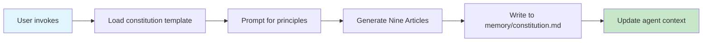

#### The Nine Articles of Development

The constitution defines nine articles that shape every aspect of the development process:

#### Article I: Library-First Principle

Every feature must begin as a standalone library—no exceptions. This forces modular design from the start:

```text
Every feature in Specify MUST begin its existence as a standalone library.
No feature shall be implemented directly within application code without
first being abstracted into a reusable library component.
```

This principle ensures that specifications generate modular, reusable code rather than monolithic applications.

#### Article II: CLI Interface Mandate

Every library must expose its functionality through a command-line interface:

```text
All CLI interfaces MUST:
- Accept text as input (via stdin, arguments, or files)
- Produce text as output (via stdout)
- Support JSON format for structured data exchange
```

This enforces observability and testability. Everything must be accessible and verifiable through text-based interfaces.

#### Article III: Test-First Imperative

The most transformative article—no code before tests:

```text
This is NON-NEGOTIABLE: All implementation MUST follow strict Test-Driven Development.
No implementation code shall be written before:
1. Unit tests are written
2. Tests are validated and approved by the user
3. Tests are confirmed to FAIL (Red phase)
```

This completely inverts traditional AI code generation. The LLM must first generate comprehensive tests that define behavior, get them approved, and only then generate implementation.

#### Articles IV-VI: Quality & Documentation Standards

These articles cover code quality, documentation requirements, and performance standards that ensure maintainable, well-documented software.

#### Articles VII & VIII: Simplicity and Anti-Abstraction

These paired articles combat over-engineering:

```text
Section 7.3: Minimal Project Structure
- Maximum 3 projects for initial implementation
- Additional projects require documented justification

Section 8.1: Framework Trust
- Use framework features directly rather than wrapping them
```

The implementation plan template's "Phase -1 Gates" directly enforce these principles.

#### Article IX: Integration-First Testing

Prioritizes real-world testing over isolated unit tests:

```text
Tests MUST use realistic environments:
- Prefer real databases over mocks
- Use actual service instances over stubs
- Contract tests mandatory before implementation
```

This ensures generated code works in practice, not just in theory.

#### Constitution Structure

```markdown
# Project Constitution

## Article I: Library-First Principle
[Customized based on user input]

## Article II: CLI Interface Mandate
[Standard template with customizations]

## Article III: Test-First Imperative
[Standard TDD requirements]

## Article IV: Documentation Standard
[Project-specific documentation requirements]

## Article V: Error Handling Protocol
[Error handling patterns]

## Article VI: Dependency Management
[Dependency philosophy]

## Article VII: Simplicity Doctrine
[Simplicity guidelines]

## Article VIII: Anti-Abstraction Rule
[Anti-over-engineering rules]

## Article IX: Integration-First Testing
[Testing approach]

## Custom Articles
[Additional project-specific articles]
```

#### Example Session

```
User: /speckit.constitution

AI: I'll help you create your project constitution. This will define the architectural 
    principles that guide all development. Please provide your key principles:
    
    Examples:
    - "Modular, library-first design with comprehensive testing"
    - "Microservices architecture with API-first development"
    - "Real-time systems with performance optimization"
    
    Your principles:

User: I want to build a scalable web application with:
- Microservices architecture
- API-first design
- Comprehensive integration testing
- Minimal dependencies
- Real-time capabilities

AI: Excellent! I'll create a constitution that emphasizes these principles:
    - Article I: Service-First Principle (adapted from Library-First)
    - Article II: API Interface Mandate (adapted from CLI Mandate)
    - Article IX: Integration-First Testing (perfect match)
    - Custom Article: Scalability Requirements
    - Custom Article: Real-Time Communication Standards
    
    [Generates constitution.md with these principles]
```

### 2. `/speckit.specify` - Requirements Engineering

#### Purpose & Scope
Creates detailed feature specifications focusing on WHAT and WHY, not HOW. This is where business requirements are translated into technical specifications.

#### Technical Process

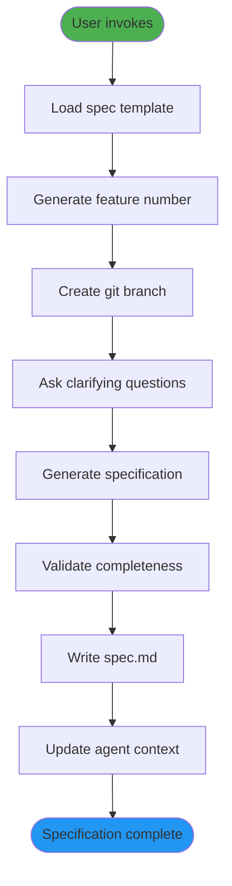

#### Specification Template Structure

```markdown
# Feature Specification: NNN-Feature-Name

## Overview
[Brief description of the feature]

## Problem Statement
[What problem does this solve?]

## Success Criteria
[Measurable outcomes]

## User Stories
[As a [user], I want [action] so that [benefit]]

## Functional Requirements
[Detailed functional specifications]

## Non-Functional Requirements
[Performance, security, scalability requirements]

## Constraints & Assumptions
[Technical constraints and assumptions]

## Dependencies
[Dependencies on other features or systems]

## Risks & Mitigations
[Potential risks and mitigation strategies]

## Clarifications
[Q&A session results]

## Acceptance Criteria
[Criteria for feature completion]
```

#### Advanced Specification Patterns

##### Pattern 1: API-First Specification

```markdown
## API Contracts

### Endpoints
- POST /api/v1/users
- GET /api/v1/users/{id}
- PUT /api/v1/users/{id}
- DELETE /api/v1/users/{id}

### Request/Response Schemas
[Detailed JSON schemas]

### Error Responses
[Standardized error format]

### Authentication & Authorization
[Security requirements]
```

##### Pattern 2: Data-Intensive Feature

```markdown
## Data Model

### Entities
[Core data entities and relationships]

### Data Flow
[How data moves through the system]

### Storage Requirements
[Database, caching, file storage needs]

### Migration Strategy
[How to migrate existing data]

### Privacy & Compliance
[GDPR, CCPA, etc. considerations]
```

##### Pattern 3: Real-Time Feature

```markdown
## Real-Time Requirements

### Latency Requirements
[Maximum acceptable latency]

### Concurrency Model
[How concurrent users are handled]

### Event Specifications
[Events, payloads, and handlers]

### Scaling Behavior
[How the system scales under load]

### Monitoring & Alerting
[What to monitor and alert on]
```

### 3. `/speckit.clarify` - Resolution of Ambiguities

#### Purpose & Scope
Resolves ambiguities in specifications through structured Q&A. Acts as "unit tests for English" to ensure requirements clarity.

#### When to Use
- After initial specification is written
- When requirements seem unclear or incomplete
- Before moving to planning phase
- When stakeholders have questions

#### Clarification Algorithm

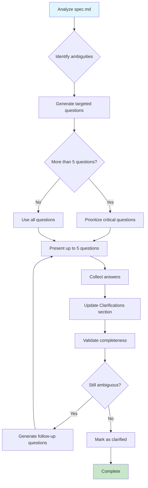

#### Question Categories

1. **Functional Clarity**
   - What exactly happens when [action]?
   - What are the edge cases for [scenario]?
   - How should [feature] behave under [condition]?

2. **Non-Functional Requirements**
   - What are the performance expectations?
   - What security measures are required?
   - What are the scalability requirements?

3. **Integration Points**
   - How does this interact with existing systems?
   - What APIs need to be called?
   - What data needs to be synchronized?

4. **User Experience**
   - What should the user see/do?
   - What feedback should be provided?
   - What error messages are appropriate?

5. **Business Logic**
   - What are the business rules?
   - What validations are required?
   - What are the success/failure criteria?

### 4. `/speckit.checklist` - Quality Assurance

#### Purpose & Scope
Generates custom quality checklists to validate requirements completeness, clarity, and consistency. This is a **proactive quality measure** that prevents issues before they occur.

#### When to Use
- After specification is complete
- Before or during planning phase
- For peer review of specifications
- To ensure comprehensive coverage

#### Checklist Generation Algorithm

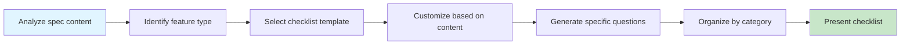

#### Checklist Categories

##### Requirements Completeness
- [ ] Are all user roles clearly defined?
- [ ] Are success criteria measurable?
- [ ] Are error scenarios documented?
- [ ] Are performance requirements specified?
- [ ] Are security requirements addressed?
- [ ] Are accessibility needs considered?
- [ ] Are integration points identified?
- [ ] Are data validation rules clear?

##### Technical Specification
- [ ] Are API contracts defined?
- [ ] Is data model specified?
- [ ] Are dependencies identified?
- [ ] Is technology stack specified?
- [ ] Are environment requirements documented?
- [ ] Are deployment considerations included?

##### Business Logic
- [ ] Are business rules explicit?
- [ ] Are edge cases covered?
- [ ] Is audit trail required?
- [ ] Are compliance needs addressed?
- [ ] Are reporting requirements specified?

##### User Experience
- [ ] Are user workflows defined?
- [ ] Is feedback mechanism specified?
- [ ] Are error messages defined?
- [ ] Is navigation clear?
- [ ] Is accessibility ensured?

### 5. `/speckit.plan` - Technical Architecture

#### Purpose & Scope
Creates detailed technical implementation plan with architecture choices, technology decisions, and integration patterns. This is the bridge between requirements and implementation.

#### Technical Process

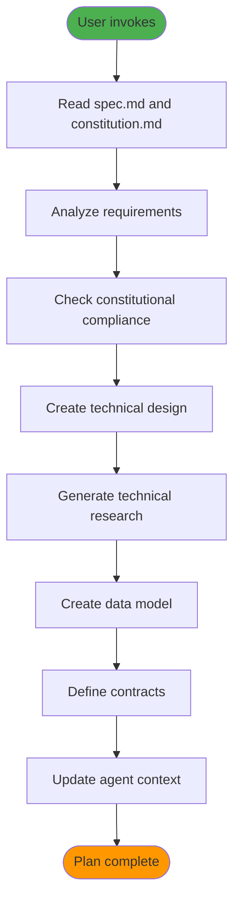

#### Plan Structure

```markdown
# Implementation Plan: NNN-Feature-Name

## Architecture Overview
[System architecture description]

## Technology Stack
[Technologies to be used]

## Component Design
[Detailed component specifications]

## Data Model
[Database schema and relationships]

## API Contracts
[API specifications]

## Integration Points
[System integration details]

## Security Considerations
[Security implementation plan]

## Performance Strategy
[Performance optimization approach]

## Testing Strategy
[Testing approach and coverage]

## Deployment Plan
[Deployment strategy]

## Risk Assessment
[Technical risks and mitigations]

## Implementation Tasks
[High-level task breakdown]
```

#### Constitutional Compliance Checking

Each plan is automatically checked against the project constitution:

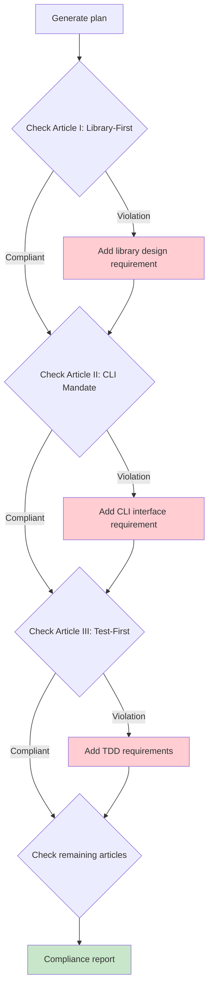

### 6. `/speckit.analyze` - Validation & Quality Gates

#### Purpose & Scope
Performs cross-artifact validation and quality checks to ensure all components are aligned and compliant. This is the **quality gate** before implementation.

#### Analysis Categories

##### Consistency Analysis
- **Spec-Plan Alignment**: Does the plan address all spec requirements?
- **Plan-Tasks Alignment**: Do tasks cover the entire plan?
- **Constitutional Compliance**: Does the design follow project principles?

##### Completeness Analysis
- **Requirements Coverage**: Are all requirements addressed?
- **Implementation Coverage**: Is the implementation plan complete?
- **Testing Coverage**: Are all aspects tested?

##### Quality Analysis
- **Architectural Soundness**: Is the architecture viable?
- **Performance Considerations**: Are performance needs addressed?
- **Security Assessment**: Are security requirements met?

#### Severity Classification

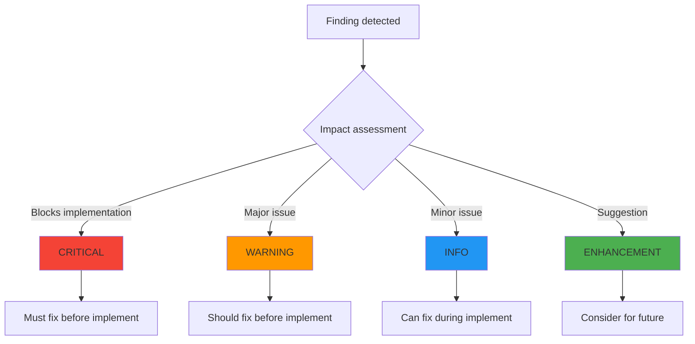

#### Analysis Report Structure

```markdown
# Analysis Report: NNN-Feature-Name

## Executive Summary
[Overall assessment and recommendation]

## Critical Findings
[Must-fix issues that block implementation]

## Warnings
[Should-fix issues]

## Informational Items
[Good-to-know items]

## Enhancement Opportunities
[Future improvement suggestions]

## Compliance Status
[Constitutional compliance report]

## Recommendation
[Proceed/Fix first/Replan]
```

### 7. `/speckit.tasks` - Implementation Planning

#### Purpose & Scope
Generates actionable task breakdown from implementation plan with dependency management and parallelization opportunities.

#### Task Generation Algorithm

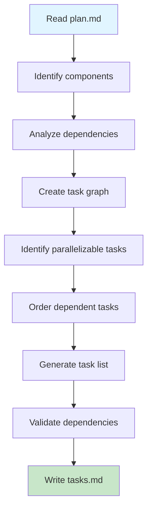

#### Task Structure

```markdown
# Task Breakdown: NNN-Feature-Name

## Task Dependencies
[Dependency graph visualization]

## Task List

### [PARALLEL] Task 1: Setup Database Schema
**Dependencies**: None
**Estimated Time**: 30 minutes
**Description**: Create database tables and migrations
**Acceptance Criteria**: 
- Tables created with correct schema
- Migration scripts tested
- Rollback procedures verified

### [PARALLEL] Task 2: Create User Model
**Dependencies**: None
**Estimated Time**: 45 minutes
**Description**: Implement user data model with validation
**Acceptance Criteria**:
- Model implements all fields
- Validation rules working
- Unit tests passing

### [DEPENDS: 1,2] Task 3: Implement Registration Endpoint
**Dependencies**: Task 1, Task 2
**Estimated Time**: 60 minutes
**Description**: Create user registration API endpoint
**Acceptance Criteria**:
- Endpoint accepts valid requests
- Error handling implemented
- Integration tests passing

### [DEPENDS: 3] Task 4: Add Email Verification
**Dependencies**: Task 3
**Estimated Time**: 40 minutes
**Description**: Implement email verification workflow
**Acceptance Criteria**:
- Verification emails sent
- Tokens validated correctly
- Account activation working

## Implementation Notes
[Additional guidance for implementation]
```

### 8. `/speckit.implement` - Execution Engine

#### Purpose & Scope
Executes implementation based on generated tasks using TDD methodology. This is where code is actually written and tested.

#### Implementation Process

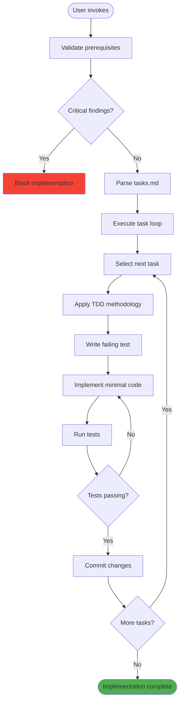

#### TDD Implementation Pattern

For each task:

1. **Test First**
   ```python
   # Write test that should fail
   def test_user_registration():
       user = User.register("test@example.com", "password123")
       assert user.email == "test@example.com"
       assert user.is_verified == False
   ```

2. **Run Test (Expected to Fail)**
   ```bash
   pytest tests/test_user.py::test_user_registration -v
   # Expected: FAILED
   ```

3. **Implement Minimal Code**
   ```python
   class User:
       def __init__(self, email, password):
           self.email = email
           self.password_hash = hash_password(password)
           self.is_verified = False
       
       @classmethod
       def register(cls, email, password):
           return cls(email, password)
   ```

4. **Run Test (Expected to Pass)**
   ```bash
   pytest tests/test_user.py::test_user_registration -v
   # Expected: PASSED
   ```

5. **Refactor if Needed**
6. **Commit Changes**
   ```bash
   git add .
   git commit -m "feat: implement user registration with test"
   ```

---

## Brownfield Project Integration

### Understanding Brownfield Challenges

Brownfield projects present unique challenges for Spec-Kit adoption:

#### Technical Debt
- Existing code may not follow constitutional principles
- Legacy patterns conflict with Spec-Kit methodology
- Inconsistent architecture across modules

#### Integration Complexity
- Existing systems have established patterns
- Dependencies may constrain new approaches
- Team familiarity with current processes

#### Risk Management
- Changes to existing systems are high-risk
- Production stability must be maintained
- Gradual adoption is essential

### Brownfield Adoption Strategy

#### Phase 1: Observation and Documentation (Week 1-2)

**Objective**: Understand existing architecture without making changes

```bash
# Initialize Spec-Kit in observation mode
cd existing-project
specify init --here

# Create documentation constitution
/speckit.constitution
# Focus on documenting existing patterns:
# "Document current architecture, identify patterns, 
#  note constraints, preserve existing contracts"
```

**Activities**:
1. **Architecture Analysis**
   ```bash
   # Use Spec-Kit to document existing architecture
   /speckit.specify "Document existing user management system"
   # Focus on: current patterns, technologies, constraints
   ```

2. **Pattern Identification**
   ```markdown
   # Document findings in plan.md
   ## Existing Patterns
   - MVC architecture with Express.js
   - Sequelize ORM for database access
   - JWT for authentication
   - Jest for testing
   - Docker for deployment
   
   ## Constraints
   - Must maintain API compatibility
   - Database schema cannot be easily changed
   - Legacy authentication system must be supported
   ```

3. **Constraint Documentation**
   ```bash
   /speckit.plan
   # Document all technical and business constraints
   # Identify which parts can be modernized
   # Note integration requirements
   ```

#### Phase 2: Parallel Development (Week 3-6)

**Objective**: Build new features using Spec-Kit while maintaining existing systems

```bash
# Set up parallel development workflow
git checkout -b feature/new-with-speckit
/speckit.specify "New feature using modern patterns"
# Explicitly state: "Use new patterns but integrate with existing"
```

**Integration Patterns**:

1. **Adapter Pattern for Legacy Integration**
   ```python
   # New service following Spec-Kit principles
   class ModernUserService:
       def __init__(self):
           self.user_repo = ModernUserRepository()
       
       def create_user(self, data):
           # Modern implementation with TDD
           pass
   
   # Adapter for legacy system
   class LegacyUserAdapter:
       def __init__(self):
           self.modern_service = ModernUserService()
           self.legacy_system = LegacyUserSystem()
       
       def create_user_legacy_format(self, data):
           # Convert to modern format
           modern_data = self.convert_to_modern(data)
           user = self.modern_service.create_user(modern_data)
           # Convert back to legacy format if needed
           return self.convert_to_legacy(user)
   ```

2. **Strangler Fig Pattern**
   ```python
   # Gradually replace legacy components
   class UserService:
       def __init__(self):
           # Use new implementation for new features
           self.registration_service = ModernRegistrationService()
           # Keep legacy for existing features
           self.profile_service = LegacyProfileService()
       
       def register_user(self, data):
           # New implementation
           return self.registration_service.register(data)
       
       def update_profile(self, user_id, data):
           # Legacy implementation (to be replaced later)
           return self.profile_service.update(user_id, data)
   ```

#### Phase 3: Incremental Modernization (Week 7-12)

**Objective**: Gradually modernize existing components

```bash
# Modernize one component at a time
/speckit.specify "Modernize authentication module"
# Include: "Maintain backward compatibility, 
#          provide migration path, 
#          support legacy tokens during transition"
```

**Modernization Checklist**:

1. **Component Selection**
   - [ ] Choose low-risk component first
   - [ ] Ensure clear API boundaries
   - [ ] Document current behavior
   - [ ] Create compatibility tests

2. **Modernization Process**
   ```bash
   # 1. Document current behavior
   /speckit.specify "Document current auth behavior"
   
   # 2. Design modern replacement
   /speckit.plan
   # Include: backward compatibility, migration strategy
   
   # 3. Implement alongside legacy
   /speckit.implement
   # New code coexists with old code
   
   # 4. Gradual migration
   # Switch traffic incrementally
   ```

3. **Validation Strategy**
   ```python
   # Run both systems in parallel
   class AuthValidator:
       def validate_migration(self, request):
           legacy_result = self.legacy_auth.authenticate(request)
           modern_result = self.modern_auth.authenticate(request)
           
           # Compare results
           assert self.results_compatible(legacy_result, modern_result)
           
           # Log differences for investigation
           if not self.results_identical(legacy_result, modern_result):
               self.log_difference(request, legacy_result, modern_result)
           
           return modern_result
   ```

#### Phase 4: Full Integration (Week 13+)

**Objective**: Complete migration to Spec-Kit methodology

```bash
# Update constitution to reflect new standards
/speckit.constitution
# "Modern architecture with full Spec-Kit adoption,
#  all new development follows SDD principles,
#  legacy systems deprecated or migrated"
```

### Brownfield Constitution Template

```markdown
# Brownfield Project Constitution

## Article I: Legacy Compatibility Principle
All new features must maintain compatibility with existing systems unless explicitly approved for breaking changes.

## Article II: Incremental Modernization Mandate
Modernization efforts shall proceed incrementally, with one component at a time, ensuring system stability.

## Article III: Adapter Pattern Requirement
Integration between new and legacy systems must use adapter patterns to maintain clean separation.

## Article IV: Test-First Legacy Integration
All integrations with legacy systems must include comprehensive tests to ensure compatibility.

## Article V: Documentation Imperative
All legacy patterns and constraints must be documented before modernization attempts.

## Article VI: Risk-Managed Deployment
Deployments must include rollback procedures and gradual traffic shifting.

## Article VII: Performance Monitoring
New implementations must be monitored for performance regressions compared to legacy systems.

## Article VIII: Team Transition Protocol
Team members must be trained on Spec-Kit methodology before full adoption.

## Article IX: Quality Gate Enforcement
All changes must pass analysis checks to ensure they don't break existing functionality.
```

### Brownfield Checklist Usage

#### When to Use Checklists in Brownfield Projects

1. **Before Integration**
   ```bash
   /speckit.checklist
   # Generates integration-specific checklist:
   # - Are legacy API contracts maintained?
   # - Is backward compatibility ensured?
   # - Are migration scripts tested?
   # - Is performance impact assessed?
   ```

2. **During Modernization**
   ```bash
   /speckit.checklist
   # Generates modernization checklist:
   # - Are all legacy behaviors preserved?
   # - Is data migration validated?
   # - Are rollback procedures tested?
   # - Is team training completed?
   ```

3. **Before Deployment**
   ```bash
   /speckit.checklist
   # Generates deployment checklist:
   # - Are monitoring systems in place?
   # - Is traffic shifting configured?
   # - Are rollback triggers set?
   # - Are stakeholder communications ready?
   ```

### Common Brownfield Scenarios

#### Scenario 1: Database Schema Constraints

```bash
# Problem: Cannot change existing database schema
/speckit.specify "Add user preferences without schema changes"

# Solution approach:
/speckit.plan
# - Use JSON field for new data
# - Create migration layer for data access
# - Maintain existing table structure
# - Add compatibility layer

/speckit.checklist
# Generated checklist:
# - [ ] Are existing queries unaffected?
# - [ ] Is JSON field properly indexed?
# - [ ] Is data migration validated?
# - [ ] Are backup procedures tested?
```

#### Scenario 2: API Version Compatibility

```bash
# Problem: Must maintain v1 API while adding v2
/speckit.specify "Add v2 API while maintaining v1 compatibility"

/speckit.plan
# - Create v2 endpoints with new patterns
# - Keep v1 endpoints unchanged
# - Add translation layer for shared logic
# - Implement version detection

/speckit.checklist
# - [ ] Are v1 API contracts preserved?
# - [ ] Is version routing correct?
# - [ ] Are both versions tested?
# - [ ] Is documentation updated?
```

#### Scenario 3: Team Skill Transition

```bash
# Problem: Team not familiar with TDD or Spec-Kit
/speckit.constitution
# "Gradual adoption with training requirements:
#  - Start with specification phase only
#  - Add TDD for new components
#  - Provide pair programming sessions
#  - Create pattern libraries"

/speckit.checklist
# - [ ] Are team members trained on new patterns?
# - [ ] Are coding standards documented?
# - [ ] Are review processes updated?
# - [ ] Are mentorship programs in place?
```

---

## Constitutional Governance Framework

### The Nine Articles of Development

The constitution is the heart of Spec-Kit's governance system. Each article enforces specific architectural principles.

#### Article I: Library-First Principle

**Philosophy**: Every feature must start as a standalone library to promote modular design and reusability.

**Technical Requirements**:
- Features must be implemented as independent packages
- Libraries should have clear interfaces and minimal dependencies
- Core logic must be separable from application-specific code
- Libraries must be testable in isolation

**Implementation Pattern**:
```python
# Library structure
auth-lib/
├── auth_lib/
│   ├── __init__.py
│   ├── core/
│   │   ├── authentication.py
│   │   ├── authorization.py
│   │   └── token_management.py
│   ├── models/
│   │   └── user.py
│   └── utils/
│       └── password.py
├── tests/
│   ├── test_authentication.py
│   └── test_authorization.py
├── cli.py              # CLI interface
└── setup.py           # Package configuration

# Usage in application
from auth_lib import AuthenticationService

auth_service = AuthenticationService(database_url)
result = auth_service.authenticate(email, password)
```

**Compliance Checking**:
```python
def check_library_first_compliance(plan):
    violations = []
    
    # Check if feature is designed as library
    if not plan.has_library_structure():
        violations.append("Feature must be designed as standalone library")
    
    # Check for clear interface
    if not plan.has_public_api():
        violations.append("Library must expose clear public interface")
    
    # Check for minimal dependencies
    if plan.has_excessive_dependencies():
        violations.append("Library should have minimal dependencies")
    
    return violations
```

#### Article II: CLI Interface Mandate

**Philosophy**: Every library must expose functionality through a command-line interface, ensuring direct usability and testability.

**Technical Requirements**:
- Each library must provide a CLI entry point
- CLI should support all major functionality
- Commands must be well-documented and discoverable
- CLI should return appropriate exit codes

**Implementation Pattern**:
```python
# cli.py
import click
from auth_lib.core.authentication import AuthenticationService

@click.group()
def auth():
    """Authentication CLI commands"""
    pass

@auth.command()
@click.argument('email')
@click.argument('password')
def login(email, password):
    """Authenticate user with email and password"""
    service = AuthenticationService()
    result = service.authenticate(email, password)
    
    if result.success:
        click.echo(f"Login successful: {result.token}")
        return 0
    else:
        click.echo(f"Login failed: {result.error}")
        return 1

@auth.command()
@click.argument('email')
@click.argument('password')
def register(email, password):
    """Register new user"""
    service = AuthenticationService()
    result = service.register(email, password)
    
    if result.success:
        click.echo(f"User registered: {result.user_id}")
        return 0
    else:
        click.echo(f"Registration failed: {result.error}")
        return 1

if __name__ == '__main__':
    auth()
```

**CLI Testing Pattern**:
```python
def test_cli_login():
    runner = CliRunner()
    result = runner.invoke(auth, ['login', 'test@example.com', 'password'])
    
    assert result.exit_code == 0
    assert 'Login successful' in result.output

def test_cli_login_invalid():
    runner = CliRunner()
    result = runner.invoke(auth, ['login', 'invalid@example.com', 'wrong'])
    
    assert result.exit_code == 1
    assert 'Login failed' in result.output
```

#### Article III: Test-First Imperative

**Philosophy**: Write tests first, validate they fail, then implement. This ensures testable design and comprehensive coverage.

**Technical Requirements**:
- All code must be written test-first
- Tests must fail before implementation
- No production code without corresponding tests
- Integration tests preferred over mocks

**TDD Workflow**:
```python
# Step 1: Write failing test
def test_user_registration_with_duplicate_email():
    # Arrange
    service = UserService()
    service.register("test@example.com", "password")
    
    # Act & Assert
    with pytest.raises(DuplicateEmailError):
        service.register("test@example.com", "another_password")

# Step 2: Run test (fails)
# pytest tests/test_user.py::test_user_registration_with_duplicate_email
# Expected: FAILED - DuplicateEmailError not raised

# Step 3: Implement minimal code
class UserService:
    def __init__(self):
        self.users = {}
    
    def register(self, email, password):
        if email in self.users:
            raise DuplicateEmailError(f"Email {email} already registered")
        
        user = User(email, password)
        self.users[email] = user
        return user

# Step 4: Run test (passes)
# Step 5: Refactor if needed
```

**Test Categories**:
1. **Unit Tests**: Test individual components in isolation
2. **Integration Tests**: Test component interactions
3. **Contract Tests**: Test API contracts and interfaces
4. **Performance Tests**: Test performance requirements
5. **Security Tests**: Test security requirements

#### Article IV: Documentation Standard

**Philosophy**: Comprehensive documentation is essential for maintainability and knowledge transfer.

**Documentation Requirements**:
- README with quick start guide
- API documentation with examples
- Architecture decision records (ADRs)
- Code comments for complex logic
- User guides for CLI tools

**Documentation Structure**:
```
library/
├── README.md              # Overview and quick start
├── docs/
│   ├── api/              # API documentation
│   ├── guides/           # User guides
│   ├── examples/         # Code examples
│   └── architecture/     # Architecture decisions
├── CHANGELOG.md          # Version history
└── CONTRIBUTING.md       # Contribution guidelines
```

#### Article V: Error Handling Protocol

**Philosophy**: Robust error handling with clear error messages and proper error propagation.

**Error Handling Requirements**:
- Custom exception types for different error categories
- Clear error messages with context
- Proper error logging and monitoring
- Graceful degradation where possible

**Error Handling Pattern**:
```python
# Custom exceptions
class AuthenticationError(Exception):
    """Base authentication error"""
    pass

class InvalidCredentialsError(AuthenticationError):
    """Invalid username or password"""
    pass

class AccountLockedError(AuthenticationError):
    """Account is locked"""
    pass

# Error handling in service
class AuthenticationService:
    def authenticate(self, email, password):
        try:
            user = self.get_user(email)
            if not user:
                raise InvalidCredentialsError("User not found")
            
            if user.is_locked:
                raise AccountLockedError("Account is locked")
            
            if not user.verify_password(password):
                raise InvalidCredentialsError("Invalid password")
            
            return AuthResult(success=True, token=user.generate_token())
            
        except DatabaseError as e:
            logger.error(f"Database error during authentication: {e}")
            raise AuthenticationError("Authentication service unavailable")
```

#### Article VI: Dependency Management

**Philosophy**: Minimal, justified dependencies with clear version management.

**Dependency Requirements**:
- Each dependency must be justified
- Prefer standard library over external packages
- Fixed version requirements for reproducibility
- Regular dependency audits

**Dependency Management Pattern**:
```toml
# pyproject.toml
[build-system]
requires = ["setuptools>=45", "wheel"]
build-backend = "setuptools.build_meta"

[project]
name = "auth-lib"
version = "1.0.0"
dependencies = [
    "click>=8.0.0",      # CLI framework (justified: required for CLI mandate)
    "pydantic>=1.8.0",   # Data validation (justified: type safety)
    "cryptography>=3.0.0", # Password hashing (justified: security)
]

[project.optional-dependencies]
dev = [
    "pytest>=6.0.0",     # Testing framework
    "pytest-cov>=2.0.0", # Coverage reporting
    "black>=21.0.0",     # Code formatting
    "mypy>=0.910",       # Type checking
]
```

#### Article VII: Simplicity Doctrine

**Philosophy**: Keep solutions simple and avoid over-engineering.

**Simplicity Guidelines**:
- Choose the simplest solution that works
- Avoid premature optimization
- Prefer explicit over implicit
- Don't build what you don't need

**Simplicity Checklist**:
```python
def check_simplicity_compliance(design):
    violations = []
    
    # Check for over-abstraction
    if design.has_excessive_layers():
        violations.append("Too many abstraction layers")
    
    # Check for unnecessary complexity
    if design.has_unused_features():
        violations.append("Includes unnecessary features")
    
    # Check for premature optimization
    if design.has_premature_optimization():
        violations.append("Premature optimization detected")
    
    return violations
```

#### Article VIII: Anti-Abstraction Rule

**Philosophy**: Combat over-engineering by limiting project structure and promoting direct framework use.

**Anti-Abstraction Guidelines**:
- Don't create abstraction layers without clear need
- Use framework features directly
- Avoid "framework-agnostic" layers
- Prefer composition over complex inheritance

**Example - What to Avoid**:
```python
# Bad: Over-abstracted
class AbstractUserFactory:
    def create_user(self): pass

class DatabaseUserFactory(AbstractUserFactory):
    def create_user(self): pass

class RedisUserFactory(AbstractUserFactory):
    def create_user(self): pass

class UserFactoryManager:
    def __init__(self, factory):
        self.factory = factory
    
    def get_factory(self):
        return self.factory

# Good: Direct and simple
class UserService:
    def __init__(self, database):
        self.db = database
    
    def create_user(self, data):
        return self.db.users.create(data)
```

#### Article IX: Integration-First Testing

**Philosophy**: Prefer real databases and services over mocks for authentic testing.

**Integration Testing Requirements**:
- Use real databases for integration tests
- Test against actual external services when possible
- Use testcontainers for external dependencies
- Mock only when absolutely necessary

**Integration Testing Pattern**:
```python
# Using testcontainers for real database testing
from testcontainers.postgres import PostgresContainer

class TestUserServiceIntegration:
    @classmethod
    def setup_class(cls):
        cls.postgres = PostgresContainer("postgres:13")
        cls.postgres.start()
        
        cls.db = Database(cls.postgres.get_connection_url())
        cls.db.create_tables()
    
    @classmethod
    def teardown_class(cls):
        cls.postgres.stop()
    
    def test_user_registration_flow(self):
        # Test with real database
        service = UserService(self.db)
        
        # Register user
        user = service.register("test@example.com", "password")
        assert user.email == "test@example.com"
        
        # Verify user exists in database
        retrieved = self.db.users.get(user.id)
        assert retrieved.email == "test@example.com"
```

### Constitutional Compliance Enforcement

#### Automated Compliance Checking

```python
class ConstitutionalComplianceChecker:
    def __init__(self, constitution):
        self.constitution = constitution
        self.checkers = {
            'library_first': self.check_library_first,
            'cli_mandate': self.check_cli_mandate,
            'test_first': self.check_test_first,
            'documentation': self.check_documentation,
            'error_handling': self.check_error_handling,
            'dependencies': self.check_dependencies,
            'simplicity': self.check_simplicity,
            'anti_abstraction': self.check_anti_abstraction,
            'integration_testing': self.check_integration_testing
        }
    
    def check_compliance(self, plan):
        violations = []
        
        for article, checker in self.checkers.items():
            article_violations = checker(plan)
            violations.extend([
                f"{article}: {violation}" 
                for violation in article_violations
            ])
        
        return ComplianceReport(violations)
    
    def check_library_first(self, plan):
        violations = []
        if not plan.has_library_structure():
            violations.append("Missing library structure")
        if not plan.has_public_api():
            violations.append("Missing public API definition")
        return violations
    
    def check_cli_mandate(self, plan):
        violations = []
        if not plan.has_cli_interface():
            violations.append("Missing CLI interface")
        if not plan.has_cli_commands():
            violations.append("No CLI commands defined")
        return violations
    
    # ... other check methods
```

#### Compliance Reporting

```markdown
# Constitutional Compliance Report

## Overall Status: ⚠️  WARNING

### Critical Violations (Must Fix)
- **Article III**: Test-First Imperative - Some tasks don't include test steps
- **Article IX**: Integration-First Testing - Planned to use mocks for database

### Warnings (Should Fix)
- **Article VII**: Simplicity Doctrine - Design may be over-engineered
- **Article VIII**: Anti-Abstraction Rule - Unnecessary abstraction layer detected

### Informational Items
- **Article IV**: Documentation Standard - Consider adding more examples
- **Article VI**: Dependency Management - Review dependency necessity

## Recommendation
Fix critical violations before proceeding with implementation.
```

---

## Advanced Workflow Patterns

### Multi-Feature Development

#### Parallel Feature Development

When working on multiple features simultaneously:

```bash
# Feature 1: User Authentication
git checkout -b spec/001-user-authentication
/speckit.specify "User authentication with email and password"
/speckit.plan
/speckit.tasks

# Feature 2: User Profile
git checkout -b spec/002-user-profile
/speckit.specify "User profile management"
/speckit.plan
/speckit.tasks

# Implement features in parallel
git checkout spec/001-user-authentication
/speckit.implement

git checkout spec/002-user-profile
/speckit.implement
```

#### Feature Integration Planning

```bash
# When features depend on each other
/speckit.specify "User authentication"
# Include: "This feature will be used by user profile feature"

/speckit.specify "User profile"
# Include: "Depends on user authentication feature"
# Include: "Requires user ID from authentication system"

# Integration validation
/speckit.analyze
# Checks for: dependency consistency, API compatibility, data flow
```

### Iterative Development

#### Incremental Feature Refinement

```bash
# Initial specification
/speckit.specify "Basic user authentication"
# Focus on core functionality only

# Plan and implement core
/speckit.plan
/speckit.tasks
/speckit.implement

# Iteration 2: Add features
/speckit.specify "Enhanced authentication with social login"
# Build on existing authentication

# Plan enhancement
/speckit.plan
# Include: "Extend existing authentication system"
# Include: "Maintain backward compatibility"

# Implement enhancements
/speckit.implement
```

#### Feedback-Driven Development

```bash
# After initial implementation
/speckit.implement

# User testing reveals issues
# Update specification based on feedback
/speckit.specify "Authentication with improved UX"
# Include: "Address user feedback from testing"

# Replan with improvements
/speckit.plan
/speckit.analyze
/speckit.tasks
/speckit.implement
```

### Emergency Fixes and Hotfixes

#### Rapid Response Pattern

```bash
# Critical bug discovered
# Emergency specification
/speckit.specify "Fix critical security vulnerability in authentication"
# Include: "Emergency fix - skip normal process"
# Include: "Minimal change to address security issue"

# Emergency plan
/speckit.plan
# Include: "Hotfix deployment strategy"
# Include: "Rollback procedures"

# Emergency implementation
/speckit.implement
# Include: "Skip non-essential tests"
# Include: "Focus on security validation"

# Post-incident review
/speckit.specify "Improve authentication security"
# Include: "Prevent similar vulnerabilities"
# Include: "Add comprehensive security tests"
```

---

## Template Customization

### Understanding Template System

Templates are the core mechanism that constrains AI behavior and ensures consistency across all generated artifacts.

#### Template Locations

```
.specify/templates/
├── spec-template.md           # Specification structure
├── plan-template.md           # Implementation plan format
├── tasks-template.md          # Task breakdown format
└── agent-file-template.md     # AI agent command format
```

#### Template Variables

Templates use variable substitution for dynamic content:

```markdown
# Template example
# Feature Specification: {{FEATURE_NUMBER}}-{{FEATURE_NAME}}

## Overview
{{FEATURE_DESCRIPTION}}

## Success Criteria
{{SUCCESS_CRITERIA}}

## Technical Requirements
{{TECHNICAL_REQUIREMENTS}}
```

### Customizing Specification Template

#### Enhanced Spec Template

```markdown
# Feature Specification: {{FEATURE_NUMBER}}-{{FEATURE_NAME}}

## Executive Summary
{{EXECUTIVE_SUMMARY}}

## Problem Statement
{{PROBLEM_STATEMENT}}

## Success Criteria
{{SUCCESS_CRITERIA}}

## User Stories
{{USER_STORIES}}

## Functional Requirements
{{FUNCTIONAL_REQUIREMENTS}}

## Non-Functional Requirements
{{NON_FUNCTIONAL_REQUIREMENTS}}

## Technical Constraints
{{TECHNICAL_CONSTRAINTS}}

## Business Constraints
{{BUSINESS_CONSTRAINTS}}

## Dependencies
{{DEPENDENCIES}}

## Risk Assessment
{{RISK_ASSESSMENT}}

## Acceptance Criteria
{{ACCEPTANCE_CRITERIA}}

## Definition of Done
{{DEFINITION_OF_DONE}}

## Performance Metrics
{{PERFORMANCE_METRICS}}

## Security Requirements
{{SECURITY_REQUIREMENTS}}

## Compliance Requirements
{{COMPLIANCE_REQUIREMENTS}}

## Monitoring & Alerting
{{MONITORING_REQUIREMENTS}}

## Documentation Requirements
{{DOCUMENTATION_REQUIREMENTS}}

## Testing Strategy
{{TESTING_STRATEGY}}

## Deployment Strategy
{{DEPLOYMENT_STRATEGY}}

## Rollback Plan
{{ROLLBACK_PLAN}}

## Stakeholder Communication
{{STAKEHOLDER_COMMUNICATION}}

## Clarifications
{{CLARIFICATIONS}}

## Change History
{{CHANGE_HISTORY}}
```

### Customizing Plan Template

#### Architecture-Focused Plan Template

```markdown
# Implementation Plan: {{FEATURE_NUMBER}}-{{FEATURE_NAME}}

## Architecture Overview
{{ARCHITECTURE_OVERVIEW}}

## System Design
{{SYSTEM_DESIGN}}

## Component Architecture
{{COMPONENT_ARCHITECTURE}}

## Data Architecture
{{DATA_ARCHITECTURE}}

## Security Architecture
{{SECURITY_ARCHITECTURE}}

## Performance Architecture
{{PERFORMANCE_ARCHITECTURE}}

## Technology Stack
{{TECHNOLOGY_STACK}}

## Integration Patterns
{{INTEGRATION_PATTERNS}}

## API Design
{{API_DESIGN}}

## Database Design
{{DATABASE_DESIGN}}

## Caching Strategy
{{CACHING_STRATEGY}}

## Monitoring Strategy
{{MONITORING_STRATEGY}}

## Scaling Strategy
{{SCALING_STRATEGY}}

## Development Environment
{{DEVELOPMENT_ENVIRONMENT}}

## Testing Environment
{{TESTING_ENVIRONMENT}}

## Production Environment
{{PRODUCTION_ENVIRONMENT}}

## Development Workflow
{{DEVELOPMENT_WORKFLOW}}

## Quality Gates
{{QUALITY_GATES}}

## Risk Mitigation
{{RISK_MITIGATION}}

## Implementation Timeline
{{IMPLEMENTATION_TIMELINE}}

## Resource Requirements
{{RESOURCE_REQUIREMENTS}}

## Success Metrics
{{SUCCESS_METRICS}}

## Completion Criteria
{{COMPLETION_CRITERIA}}
```

### Customizing Tasks Template

#### Detailed Task Template

```markdown
# Task Breakdown: {{FEATURE_NUMBER}}-{{FEATURE_NAME}}

## Task Dependencies
{{TASK_DEPENDENCIES}}

## Task Categories
{{TASK_CATEGORIES}}

## Task List

### [{{TASK_TYPE}}] Task {{TASK_NUMBER}}: {{TASK_TITLE}}
**Priority**: {{TASK_PRIORITY}}
**Estimated Time**: {{ESTIMATED_TIME}}
**Dependencies**: {{TASK_DEPENDENCIES}}
**Assignee**: {{ASSIGNEE}}

**Description**
{{TASK_DESCRIPTION}}

**Acceptance Criteria**
{{ACCEPTANCE_CRITERIA}}

**Definition of Done**
{{DEFINITION_OF_DONE}}

**Testing Requirements**
{{TESTING_REQUIREMENTS}}

**Documentation Requirements**
{{DOCUMENTATION_REQUIREMENTS}}

**Security Considerations**
{{SECURITY_CONSIDERATIONS}}

**Performance Considerations**
{{PERFORMANCE_CONSIDERATIONS}}

**Rollback Criteria**
{{ROLLBACK_CRITERIA}}

**Review Requirements**
{{REVIEW_REQUIREMENTS}}

**Approval Requirements**
{{APPROVAL_REQUIREMENTS}}

## Implementation Notes
{{IMPLEMENTATION_NOTES}}

## Risk Mitigation
{{RISK_MITIGATION}}

## Quality Checks
{{QUALITY_CHECKS}}
```

### Creating Custom Templates

#### Domain-Specific Templates

For specific domains (e.g., microservices, web applications, data pipelines):

```bash
# Create microservices-specific templates
mkdir .specify/templates/microservices/

# Custom spec template for microservices
cp .specify/templates/spec-template.md .specify/templates/microservices/spec-template.md
# Edit to include microservices-specific sections

# Update configuration to use domain templates
echo "template_domain=microservices" >> .specify/config
```

#### Organization-Specific Templates

For organizational standards and compliance:

```markdown
# Organization-specific spec template
# Feature Specification: {{FEATURE_NUMBER}}-{{FEATURE_NAME}}

## Compliance Requirements
{{COMPLIANCE_REQUIREMENTS}}

## Legal Review
{{LEGAL_REVIEW}}

## Security Review
{{SECURITY_REVIEW}}

## Privacy Impact Assessment
{{PRIVACY_IMPACT_ASSESSMENT}}

## Accessibility Compliance
{{ACCESSIBILITY_COMPLIANCE}}

## Organizational Standards
{{ORGANIZATIONAL_STANDARDS}}
```

---

## Error Recovery & Debugging

### Systematic Error Analysis

When errors occur during or after implementation, follow this systematic approach:

#### Error Classification Framework

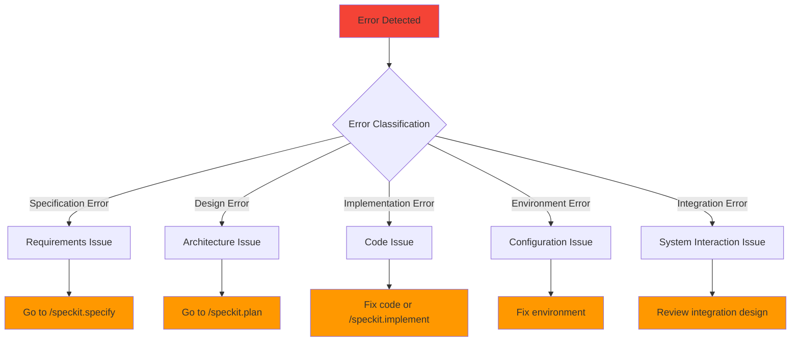

### Detailed Error Recovery Workflows

#### Workflow 1: Specification Errors

**Symptoms**:
- Feature doesn't meet user expectations
- Requirements are ambiguous or incomplete
- Stakeholders disagree on functionality

**Recovery Process**:
```bash
# 1. Identify the gap
/speckit.analyze
# Look for: "Requirements incomplete" or "Ambiguous specification"

# 2. Clarify requirements
/speckit.clarify
# Answer targeted questions to fill gaps

# 3. Update specification
/speckit.specify
# Add missing details and clarifications

# 4. Re-plan if needed
/speckit.plan
# Update technical approach based on new requirements

# 5. Validate changes
/speckit.analyze
# Ensure all artifacts are aligned

# 6. Re-implement if necessary
/speckit.tasks
/speckit.implement
```

**Example Scenario**:
```bash
# Problem: User says "This isn't what I wanted"
# Investigation reveals missing requirement for bulk operations

/speckit.specify "User management with bulk operations"
# Add: "Must support bulk import/export of users"
# Add: "Bulk operations must be transactional"
# Add: "Progress reporting for long-running bulk operations"

/speckit.plan
# Update: "Add bulk operation endpoints"
# Update: "Implement transaction management"
# Update: "Add progress tracking system"

/speckit.implement
# Implementation now includes bulk operations
```

#### Workflow 2: Design Errors

**Symptoms**:
- Performance doesn't meet requirements
- System doesn't scale as expected
- Architecture is too complex or fragile
- Security vulnerabilities discovered

**Recovery Process**:
```bash
# 1. Analyze the design flaw
/speckit.analyze
# Look for: "Architecture concerns" or "Performance issues"

# 2. Identify root cause
# Review plan.md, research.md, data-model.md
# Check architectural decisions

# 3. Redesign the solution
/speckit.plan
# Update architecture, technology choices, data model

# 4. Validate new design
/speckit.analyze
# Ensure new design addresses the issues

# 5. Re-plan implementation
/speckit.tasks
# Generate new task breakdown

# 6. Re-implement
/speckit.implement
# Implement with new architecture
```

**Example Scenario**:
```bash
# Problem: System slows down with 1000+ concurrent users
# Investigation reveals: N+1 query problem in data access

/speckit.plan
# Update: "Replace ORM queries with optimized SQL"
# Update: "Implement query result caching"
# Update: "Add database connection pooling"

/speckit.implement
# New implementation addresses performance issues
```

#### Workflow 3: Implementation Errors

**Symptoms**:
- Tests are failing
- Code has bugs
- Implementation doesn't match specification
- Performance issues in code

**Recovery Process**:
```bash
# 1. Identify the specific issue
# Review test failures, error messages, performance metrics

# 2. Determine if it's a code or design issue
/speckit.analyze
# Check if implementation matches plan

# 3. Fix code directly (minor issues)
# Edit the problematic code
# Run tests to verify fix

# 4. Or re-implement task (major issues)
/speckit.implement
# Request: "Re-implement task X with focus on [specific issue]"
```

**Example Scenario**:
```bash
# Problem: Unit tests failing for user validation
# Investigation: Regex pattern is too restrictive

# Option 1: Quick fix
# Edit validation code directly
# Run tests to verify

# Option 2: Re-implement
/speckit.implement
# "Re-implement user validation task with more flexible email validation"
```

#### Workflow 4: Integration Errors

**Symptoms**:
- API calls between services fail
- Data synchronization issues
- External service integration problems
- Database connection issues

**Recovery Process**:
```bash
# 1. Review integration contracts
cat specs/NNN-feature/contracts/api.md
cat specs/NNN-feature/contracts/integration.md

# 2. Check implementation against contracts
/speckit.analyze
# Look for: "Contract violations" or "Integration issues"

# 3. Fix contract or implementation
# Option A: Update contracts if design was wrong
/speckit.plan
# Update API contracts, integration specifications

# Option B: Fix implementation to match contracts
/speckit.implement
# "Fix integration to match defined contracts"
```

#### Workflow 5: Environment Errors

**Symptoms**:
- Code works locally but fails in deployment
- Configuration issues
- Dependency conflicts
- Infrastructure problems

**Recovery Process**:
```bash
# 1. Check environment configuration
# Review deployment configs, environment variables
# Check dependency versions

# 2. Update environment setup
# Fix configuration files
# Update dependencies
# Modify deployment scripts

# 3. Test in target environment
# Deploy to staging environment
# Run integration tests

# 4. Update documentation
/speckit.plan
# Add: "Environment configuration requirements"
# Add: "Deployment troubleshooting guide"
```

### Proactive Error Prevention

#### Pre-Implementation Validation

Always run this checklist before `/speckit.implement`:

```bash
# 1. Comprehensive analysis
/speckit.analyze
# Review all findings, especially critical ones

# 2. Specification review
cat specs/NNN-feature/spec.md
# Verify: All requirements are clear and complete

# 3. Plan review
cat specs/NNN-feature/plan.md
# Verify: Architecture addresses all requirements

# 4. Task review
cat specs/NNN-feature/tasks.md
# Verify: Tasks cover entire implementation

# 5. Constitutional compliance
# Verify: No constitutional violations

# 6. Risk assessment
# Verify: High-risk items have mitigation strategies
```

#### Quality Gates

Implement these quality gates in your workflow:

```yaml
# .github/workflows/spec-validation.yml
name: Spec-Kit Validation
on: [pull_request]

jobs:
  validate:
    runs-on: ubuntu-latest
    steps:
      - uses: actions/checkout@v3
      
      - name: Install Spec-Kit
        run: |
          curl -LsSf https://astral.sh/uv/install.sh | sh
          uv tool install specify-cli
      
      - name: Validate specifications
        run: |
          # Check if spec exists
          if [ ! -f "specs/*/spec.md" ]; then
            echo "❌ No specification found"
            exit 1
          fi
          
          # Run analysis
          specify analyze || echo "Analysis found issues"
          
          # Check constitution compliance
          if [ -f "memory/constitution.md" ]; then
            echo "✅ Constitution exists"
          else
            echo "❌ No constitution found"
            exit 1
          fi
      
      - name: Validate implementation
        run: |
          # Check if tests exist
          if [ ! -d "tests/" ]; then
            echo "❌ No tests found"
            exit 1
          fi
          
          # Run tests
          npm test || pytest || echo "Tests failed"
```

---

## Multi-Agent Strategies

### Agent Selection Guidelines

Different AI agents have different strengths. Choose based on your needs:

#### Claude Code
**Strengths**:
- Excellent at understanding complex requirements
- Strong at architectural planning
- Good at writing comprehensive specifications

**Best For**:
- `/speckit.constitution` - Setting principles
- `/speckit.specify` - Writing detailed specs
- `/speckit.plan` - Architecture design

#### GitHub Copilot
**Strengths**:
- Excellent code generation
- Strong understanding of existing codebases
- Good at implementing specific features

**Best For**:
- `/speckit.implement` - Writing implementation code
- Code refactoring tasks
- Test writing

#### Cursor
**Strengths**:
- Smart code editing and understanding
- Good at code navigation and analysis
- Strong at identifying code issues

**Best For**:
- `/speckit.analyze` - Code analysis and validation
- Code review and debugging
- Legacy code understanding

#### Windsurf
**Strengths**:
- Balanced approach to both spec and code
- Good at workflow management
- Strong at integration tasks

**Best For**:
- Complete workflow execution
- Integration-heavy features
- Project management tasks

### Multi-Agent Workflows

#### Sequential Agent Usage

Use different agents for different phases:

```bash
# Phase 1: Specification with Claude
claude /speckit.constitution
claude /speckit.specify "Complex feature with many requirements"

# Phase 2: Planning with Windsurf
windsurf /speckit.plan
windsurf /speckit.analyze

# Phase 3: Implementation with Copilot
copilot /speckit.implement

# Phase 4: Review with Cursor
cursor /speckit.analyze
```

#### Parallel Agent Usage

Use multiple agents simultaneously for different aspects:

```bash
# Agent 1: Feature specification
claude /speckit.specify "User authentication system"

# Agent 2: Security specification
claude /speckit.specify "Security requirements for auth system"

# Agent 3: Performance specification
windsurf /speckit.specify "Performance requirements for auth system"

# Merge specifications
# Combine all specs into comprehensive feature spec
```

#### Specialized Agent Tasks

Assign specialized tasks to specific agents:

```bash
# Documentation specialist
claude /speckit.specify "API documentation for user service"

# Security specialist
cursor /speckit.analyze --focus=security

# Performance specialist
windsurf /speckit.plan --focus=performance

# Test specialist
copilot /speckit.implement --focus=testing
```

### Agent Configuration

#### Customizing Agent Behavior

Each agent can be configured for specific behavior:

```markdown
# .claude/commands/specify.md (Claude-specific)
You are a requirements analyst specializing in complex system specifications.
Focus on:
- Business value and user needs
- Comprehensive requirement coverage
- Clear acceptance criteria
- Risk identification

Avoid:
- Over-technical implementation details
- Premature optimization
- Assumptions about technology
```

```markdown
# .cursor/rules/analyze.md (Cursor-specific)
You are a code quality analyst specializing in architectural validation.
Focus on:
- Code quality and maintainability
- Architecture compliance
- Security vulnerability detection
- Performance bottleneck identification

Provide:
- Specific line numbers for issues
- Concrete improvement suggestions
- Risk severity assessments
```

#### Agent Handoff Protocols

When switching between agents:

```bash
# 1. Document context for next agent
echo "Current context: Feature specification complete, moving to planning phase" > context.md

# 2. Update agent context files
./.specify/scripts/bash/update-agent-context.sh

# 3. Verify handoff
cat context.md
cat .claude/context.md
```

---

## CI/CD Integration

### Pipeline Integration Strategies

#### Pre-Commit Hooks

```bash
# .git/hooks/pre-commit
#!/bin/bash

# Run Spec-Kit validation before commits
echo "Running Spec-Kit validation..."

# Check if spec is modified
if git diff --cached --name-only | grep -q "spec.md"; then
    echo "Specification modified, running validation..."
    specify analyze || exit 1
fi

# Check if constitution is modified
if git diff --cached --name-only | grep -q "constitution.md"; then
    echo "Constitution modified, running validation..."
    specify check || exit 1
fi

# Run tests
npm test || pytest || exit 1

echo "✅ All validations passed"
```

#### GitHub Actions Integration

```yaml
# .github/workflows/spec-kit.yml
name: Spec-Kit Pipeline
on:
  push:
    branches: [main, develop]
  pull_request:
    branches: [main]

jobs:
  spec-validation:
    runs-on: ubuntu-latest
    steps:
      - uses: actions/checkout@v3
      
      - name: Setup Python
        uses: actions/setup-python@v4
        with:
          python-version: '3.9'
      
      - name: Install Spec-Kit
        run: |
          curl -LsSf https://astral.sh/uv/install.sh | sh
          uv tool install specify-cli
      
      - name: Validate Specifications
        run: |
          # Find all feature directories
          for spec_dir in specs/*/; do
            if [ -d "$spec_dir" ]; then
              echo "Validating $spec_dir"
              
              # Check required files
              if [ ! -f "$spec_dir/spec.md" ]; then
                echo "❌ Missing spec.md in $spec_dir"
                exit 1
              fi
              
              if [ ! -f "$spec_dir/plan.md" ]; then
                echo "❌ Missing plan.md in $spec_dir"
                exit 1
              fi
              
              # Run analysis
              specify analyze --spec-dir "$spec_dir" || {
                echo "❌ Analysis failed for $spec_dir"
                exit 1
              }
            fi
          done
      
      - name: Check Constitution Compliance
        run: |
          if [ ! -f "memory/constitution.md" ]; then
            echo "❌ No constitution found"
            exit 1
          fi
          
          # Validate constitution format
          specify check --constitution || exit 1
      
      - name: Generate Documentation
        run: |
          # Auto-generate API docs from specs
          specify docs --output docs/api/
          
          # Generate architecture diagrams
          specify diagrams --output docs/architecture/
      
      - name: Upload Artifacts
        uses: actions/upload-artifact@v3
        with:
          name: documentation
          path: docs/

  implementation-validation:
    runs-on: ubuntu-latest
    needs: spec-validation
    
    steps:
      - uses: actions/checkout@v3
      
      - name: Setup Environment
        run: |
          # Install dependencies
          npm install || pip install -r requirements.txt
          
          # Setup test database
          docker-compose up -d db
      
      - name: Run Tests
        run: |
          # Run unit tests
          npm test || pytest
          
          # Run integration tests
          npm run test:integration || pytest tests/integration/
          
          # Run contract tests
          npm run test:contract || pytest tests/contracts/
      
      - name: Validate Implementation
        run: |
          # Check if implementation matches specs
          specify validate --implementation || exit 1
          
          # Check constitutional compliance
          specify check --compliance || exit 1
      
      - name: Performance Tests
        run: |
          # Run performance benchmarks
          npm run test:performance || pytest tests/performance/
          
          # Check against performance requirements
          specify check --performance || exit 1
      
      - name: Security Scan
        run: |
          # Run security scanner
          npm audit || bandit
          
          # Check security requirements
          specify check --security || exit 1

  deployment-validation:
    runs-on: ubuntu-latest
    needs: implementation-validation
    if: github.ref == 'refs/heads/main'
    
    steps:
      - uses: actions/checkout@v3
      
      - name: Deploy to Staging
        run: |
          # Deploy to staging environment
          npm run deploy:staging
          
          # Validate deployment
          specify check --deployment || exit 1
      
      - name: Run Smoke Tests
        run: |
          # Run smoke tests against staging
          npm run test:smoke
          
          # Validate API contracts
          specify validate --contracts --env=staging || exit 1
      
      - name: Deploy to Production
        if: success()
        run: |
          # Deploy to production
          npm run deploy:production
          
          # Validate production deployment
          specify check --deployment --env=production || exit 1
```

#### GitLab CI Integration

```yaml
# .gitlab-ci.yml
stages:
  - validate
  - test
  - build
  - deploy

spec-validation:
  stage: validate
  image: python:3.9
  before_script:
    - curl -LsSf https://astral.sh/uv/install.sh | sh
    - uv tool install specify-cli
  script:
    - specify validate-all
  artifacts:
    reports:
      junit: spec-validation-report.xml

implementation-tests:
  stage: test
  image: node:16
  script:
    - npm install
    - npm test
    - npm run test:integration
  coverage: '/Coverage: \d+\.\d+%/'
  artifacts:
    reports:
      coverage_report:
        coverage_format: cobertura
        path: coverage/cobertura-coverage.xml

build-and-package:
  stage: build
  script:
    - npm run build
    - npm run package
  artifacts:
    paths:
      - dist/
    expire_in: 1 hour

deploy-staging:
  stage: deploy
  script:
    - npm run deploy:staging
    - npm run test:smoke
  environment:
    name: staging
    url: https://staging.example.com
  only:
    - main

deploy-production:
  stage: deploy
  script:
    - npm run deploy:production
  environment:
    name: production
    url: https://example.com
  when: manual
  only:
    - main
```

### Quality Gates in CI/CD

#### Automated Quality Gates

```yaml
# quality-gates.yml
quality_gates:
  - name: specification_completeness
    description: All specifications must be complete
    check: |
      specify check --spec-completeness
    threshold: 100%
    
  - name: constitutional_compliance
    description: No constitutional violations
    check: |
      specify check --constitution
    threshold: 0 violations
    
  - name: test_coverage
    description: Minimum test coverage
    check: |
      npm run test:coverage
    threshold: 80%
    
  - name: performance_baseline
    description: Performance regression check
    check: |
      npm run test:performance
    threshold: within 10% of baseline
    
  - name: security_scan
    description: No security vulnerabilities
    check: |
      npm audit
    threshold: 0 high/critical
```

#### Deployment Gates

```bash
# Pre-deployment validation
#!/bin/bash

# 1. Spec validation
specify validate --all || exit 1

# 2. Implementation validation
specify check --implementation || exit 1

# 3. Performance validation
specify check --performance || exit 1

# 4. Security validation
specify check --security || exit 1

# 5. Compliance validation
specify check --compliance || exit 1

echo "✅ All quality gates passed"
```

---

## Performance & Optimization

### Spec-Kit Performance Optimization

#### Template Optimization

Optimize templates for faster processing:

```markdown
# Optimized spec template
# Use variables efficiently
# Avoid complex conditional logic
# Structure for quick parsing

# Feature: {{FEATURE_NUMBER}}-{{FEATURE_NAME}}
{{#if OVERVIEW}}
## Overview
{{OVERVIEW}}
{{/if}}

{{#if REQUIREMENTS}}
## Requirements
{{REQUIREMENTS}}
{{/if}}
```

#### Caching Strategies

```bash
# Cache template processing
export SPEC_CACHE_DIR=.specify/cache

# Cache analysis results
export SPEC_ANALYSIS_CACHE=true

# Cache context updates
export SPEC_CONTEXT_CACHE=true
```

#### Parallel Processing

```bash
# Process multiple specs in parallel
specify analyze --parallel --max-workers=4

# Parallel task execution
specify implement --parallel --max-tasks=2
```

### Application Performance

#### Performance-Driven Specification

Include performance requirements in specifications:

```markdown
# Performance Requirements

## Response Time
- API responses: < 200ms (95th percentile)
- Page loads: < 2 seconds
- Database queries: < 100ms average

## Throughput
- Concurrent users: 10,000
- Requests per second: 5,000
- Data processing: 1GB/minute

## Scalability
- Horizontal scaling supported
- Auto-scaling thresholds defined
- Resource utilization targets

## Monitoring
- Response time monitoring
- Error rate tracking
- Resource utilization alerts
```

#### Performance Testing Integration

```bash
# Add performance testing to implementation
/speckit.specify "User authentication with performance requirements"
# Include: "Must handle 1000 concurrent login requests"

/speckit.plan
# Include: "Implement load testing"
# Include: "Add performance monitoring"

/speckit.implement
# Includes: Performance tests, monitoring setup
```

#### Optimization Checklist

```bash
/speckit.checklist
# Generated performance checklist:
# - [ ] Are performance requirements specified?
# - [ ] Is caching strategy defined?
# - [ ] Are database queries optimized?
# - [ ] Is monitoring implemented?
# - [ ] Are load tests included?
# - [ ] Is performance baseline established?
```

---

## Troubleshooting Reference

### Common Issues and Solutions

#### Installation Issues

**Issue**: `specify: command not found`
```bash
# Solution 1: Check uv installation
uv --version

# Solution 2: Reinstall specify-cli
uv tool uninstall specify-cli
uv tool install specify-cli --from git+https://github.com/github/spec-kit.git

# Solution 3: Check PATH
echo $PATH | grep uv
# Add uv bin directory to PATH if missing
```

**Issue**: Permission denied on scripts
```bash
# Solution: Make scripts executable
chmod +x .specify/scripts/bash/*.sh
chmod +x .specify/scripts/powershell/*.ps1
```

#### Initialization Issues

**Issue**: `specify init` fails
```bash
# Check Git repository
git status

# Initialize Git if needed
git init

# Check directory permissions
ls -la

# Try with verbose output
specify init --verbose my-project
```

#### Command Issues

**Issue**: AI agent not responding to speckit commands
```bash
# Check agent configuration
ls .claude/commands/ || ls .cursor/rules/

# Update agent context
./.specify/scripts/bash/update-agent-context.sh

# Verify agent installation
claude --version || cursor --version
```

**Issue**: Templates not loading
```bash
# Check template directory
ls .specify/templates/

# Reinitialize templates
specify init --force --here

# Check template permissions
ls -la .specify/templates/
```

#### Git Integration Issues

**Issue**: Branch creation fails
```bash
# Check Git status
git status

# Check remote configuration
git remote -v

# Fix Git configuration
git config --global user.email "you@example.com"
git config --global user.name "Your Name"
```

### Debug Mode

Enable debug mode for troubleshooting:

```bash
# Enable debug logging
export SPEC_DEBUG=true
export SPEC_VERBOSE=true

# Run commands with debug output
specify init --debug
/speckit.analyze --debug
```

### Log Analysis

Check Spec-Kit logs for issues:

```bash
# Check log files
cat .specify/logs/init.log
cat .specify/logs/analyze.log
cat .specify/logs/implement.log

# Check recent logs
tail -f .specify/logs/current.log
```

---

## Best Practices & Patterns

### Development Best Practices

#### Specification Best Practices

1. **Be Specific and Detailed**
   ```markdown
   # Good specification
   ## User Registration
   Users can register with email and password. Email must be verified 
   before account activation. Password must be at least 8 characters 
   with one uppercase, one lowercase, and one number.
   
   # Bad specification
   ## User Registration
   Add user registration.
   ```

2. **Include Acceptance Criteria**
   ```markdown
   ## Acceptance Criteria
   - [ ] User can register with valid email and password
   - [ ] Email verification is required before activation
   - [ ] Password meets complexity requirements
   - [ ] Duplicate email addresses are rejected
   - [ ] Account is locked after 5 failed attempts
   ```

3. **Define Non-Functional Requirements**
   ```markdown
   ## Performance Requirements
   - Registration response time: < 500ms
   - Email verification delivery: < 30 seconds
   - Concurrent registrations: 100/second
   
   ## Security Requirements
   - Passwords hashed with bcrypt
   - JWT tokens with 15-minute expiration
   - Rate limiting on registration endpoint
   ```

#### Implementation Best Practices

1. **Follow TDD Rigorously**
   ```python
   # Always write tests first
   def test_user_registration_email_validation():
       # Test invalid email
       with pytest.raises(InvalidEmailError):
           UserService.register("invalid-email", "password123")
       
       # Test valid email
       user = UserService.register("valid@example.com", "password123")
       assert user.email == "valid@example.com"
   ```

2. **Implement in Small Increments**
   ```bash
   # Break down large features
   /speckit.tasks
   # Review: Are tasks small and focused?
   
   /speckit.implement
   # Watch: Each task should complete quickly
   ```

3. **Commit Frequently and Meaningfully**
   ```bash
   # Good commit messages
   git commit -m "feat: add user registration endpoint"
   git commit -m "test: add email validation tests"
   git commit -m "fix: resolve password hashing issue"
   ```

### Team Collaboration Patterns

#### Review Processes

1. **Specification Review**
   ```bash
   # Before implementation
   /speckit.specify "New feature"
   # Team reviews spec.md
   # Approve before proceeding to /speckit.plan
   ```

2. **Plan Review**
   ```bash
   # Before implementation
   /speckit.plan
   # Architecture review
   # Security review
   # Performance review
   ```

3. **Implementation Review**
   ```bash
   # During implementation
   /speckit.implement
   # Code review for each commit
   # Test review for coverage
   # Integration review for compatibility
   ```

#### Knowledge Sharing

1. **Document Decisions**
   ```markdown
   ## Architecture Decision Record
   **Decision**: Use PostgreSQL for user data
   **Alternatives**: MongoDB, MySQL
   **Rationale**: ACID compliance required for user transactions
   **Consequences**: Migration complexity, strong consistency
   ```

2. **Share Patterns**
   ```bash
   # Create pattern library
   mkdir docs/patterns/
   
   # Document common patterns
   echo "Authentication pattern" > docs/patterns/auth.md
   echo "API design pattern" > docs/patterns/api.md
   echo "Testing pattern" > docs/patterns/testing.md
   ```

### Project Management Patterns

#### Feature Tracking

```bash
# Link features to project management
/speckit.specify "User authentication [PROJ-123]"
# Include: "Tracked in JIRA as PROJ-123"

# Update tracking system
git commit -m "feat: implement user auth [PROJ-123]"
```

#### Release Planning

```bash
# Plan releases with Spec-Kit
/speckit.specify "Release v1.2 features"
# Include: "Release target: 2024-03-01"
# Include: "Must complete: PROJ-123, PROJ-124, PROJ-125"

# Track release progress
/speckit.analyze
# Check: "Are all release features planned?"
```

#### Quality Metrics

```bash
# Track quality metrics
specify metrics --output metrics.json

# Metrics include:
# - Specification completeness
# - Test coverage
# - Constitutional compliance
# - Performance benchmarks
# - Security scan results
```

---

## Conclusion

This comprehensive guide provides the foundation for mastering Spec-Kit and implementing Spec-Driven Development effectively. By following these patterns, practices, and workflows, teams can achieve:

- **Higher Quality**: Through systematic validation and testing
- **Better Documentation**: With specifications as source of truth
- **Faster Development**: Through automated workflows and templates
- **Consistent Architecture**: Through constitutional governance
- **Easier Maintenance**: Through clear structure and comprehensive testing

### Key Takeaways

1. **Start with Constitution**: The constitution guides all development decisions
2. **Specify Completely**: Detailed specifications prevent rework
3. **Plan Thoroughly**: Good plans consider all aspects including performance and security
4. **Implement Incrementally**: Small, tested steps lead to reliable code
5. **Validate Continuously**: Analysis and quality gates catch issues early
6. **Learn from Errors**: Systematic error recovery improves the process

### Next Steps

1. **Install Spec-Kit** and initialize your first project
2. **Create a constitution** that reflects your project's principles
3. **Specify a small feature** to learn the workflow
4. **Implement using TDD** to experience the process
5. **Expand usage** gradually across your project
6. **Customize templates** for your specific needs

### Resources

- **GitHub Repository**: https://github.com/github/spec-kit
- **Community Discussions**: GitHub Discussions
- **Issue Reporting**: GitHub Issues
- **Templates Repository**: https://github.com/github/spec-kit-templates

---

**Last Updated**: 2025
**Version**: Based on spec-kit latest release
**License**: MIT

For continued learning and updates, join the Spec-Kit community and contribute to the ecosystem.
