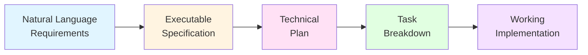
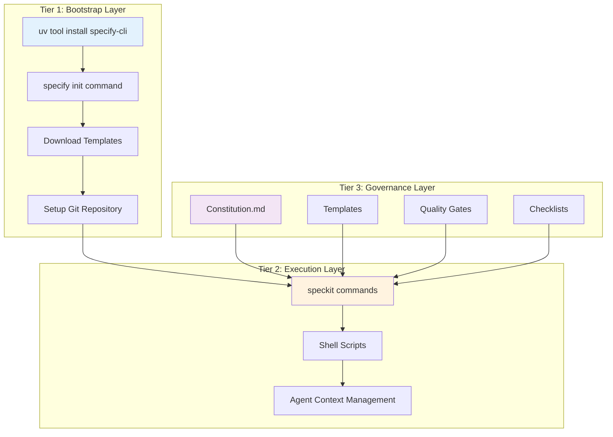
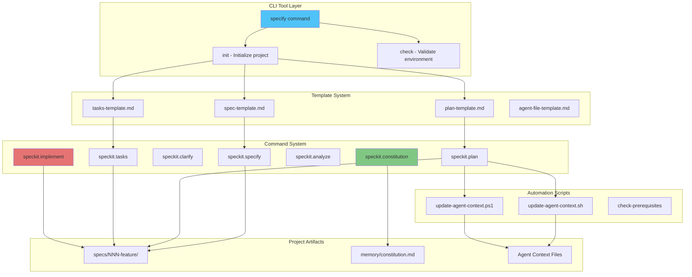
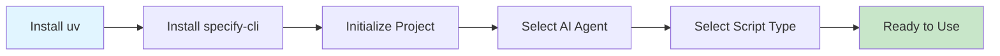
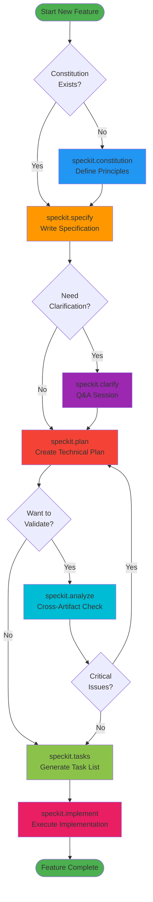
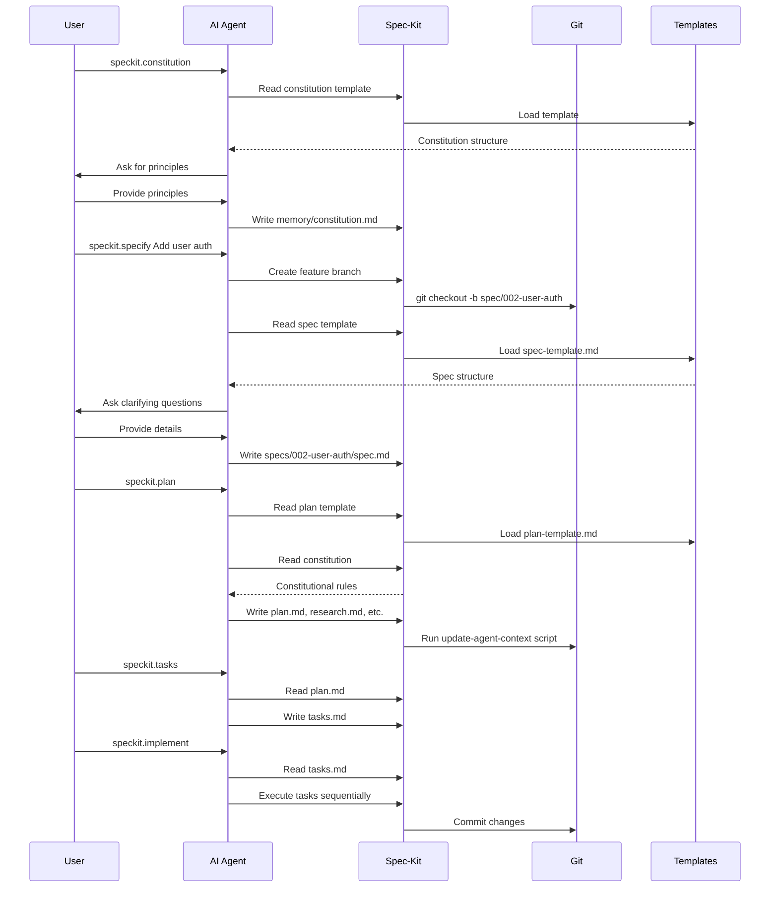
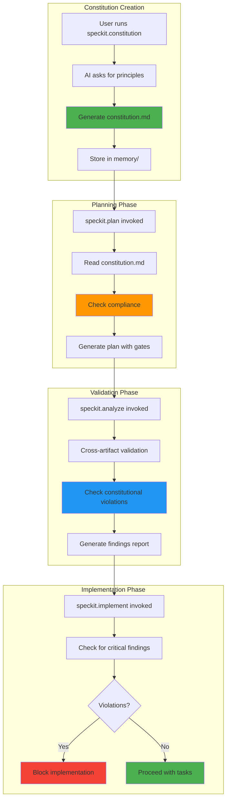
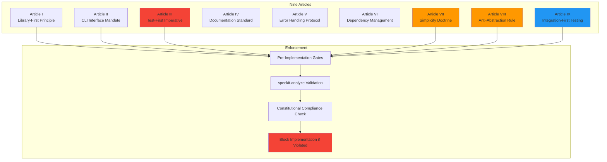
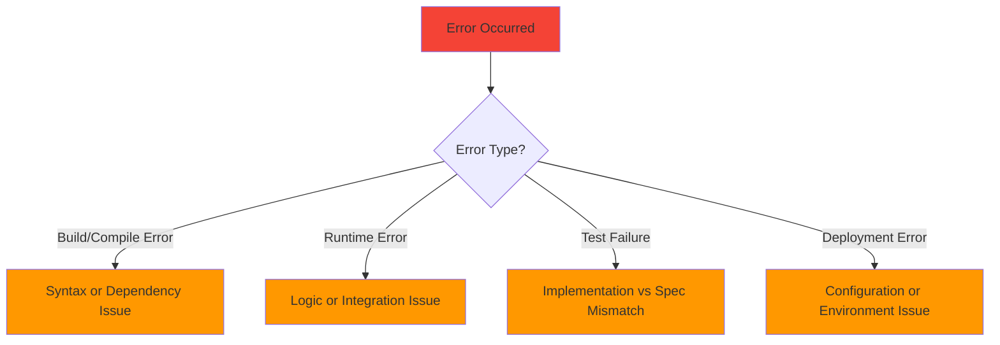
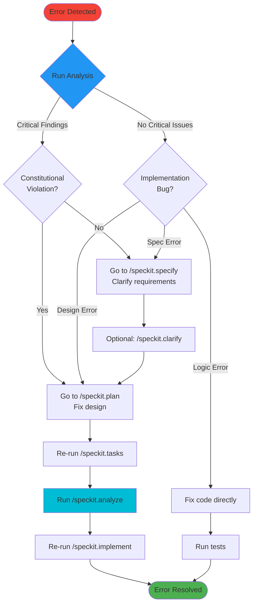

# GitHub Spec-Kit Complete Guide

> **A Spec-Driven Development (SDD) toolkit that transforms natural language requirements into working implementations through executable specifications.**

---

## 📋 Table of Contents

1. [TL;DR - Quick Start in 5 Minutes](#tldr---quick-start-in-5-minutes)
2. [Overview](#overview)
3. [Core Concepts](#core-concepts)
4. [Architecture](#architecture)
5. [Installation & Setup](#installation--setup)
6. [Workflow Diagrams](#workflow-diagrams)
7. [Command Reference](#command-reference)
8. [Constitutional Governance](#constitutional-governance)
9. [Quick Start Guide](#quick-start-guide)
10. [Cheatsheet](#cheatsheet)
11. [Error Recovery & Debugging Guide](#error-recovery--debugging-guide)

---

## TL;DR - Quick Start in 5 Minutes

**Want to start using Spec-Kit in your real project right now?** Here's the fastest path:

### 1️⃣ Install (30 seconds)

```bash
# Install uv package manager
curl -LsSf https://astral.sh/uv/install.sh | sh

# Install Spec-Kit
uv tool install specify-cli

# Initialize your project
cd your-project-folder
specify init --here
```

When prompted:
- **Select your AI agent** (e.g., Claude, Cursor, Windsurf)
- **Select script type** (Shell for Mac/Linux, PowerShell for Windows)

### 2️⃣ Set Your Project Principles (2 minutes)

Open your AI agent and run:

```
/speckit.constitution
```

Tell the AI your development principles. Example:
> "I want modular, library-first design with comprehensive testing. Keep code simple, avoid over-engineering, and use real integration tests instead of mocks."

### 3️⃣ Build Your First Feature (2 minutes)

```
/speckit.specify "Add user authentication with email and password"
```

Answer the AI's clarifying questions about your feature.

### 4️⃣ Create Implementation Plan (30 seconds)

```
/speckit.plan
```

Provide your tech stack when asked (e.g., "Node.js, Express, PostgreSQL, JWT").

### 5️⃣ Generate & Execute Tasks (30 seconds)

```
/speckit.tasks
/speckit.implement
```

**That's it!** The AI will now:
- ✅ Write tests first (TDD)
- ✅ Implement the feature
- ✅ Ensure constitutional compliance
- ✅ Commit changes incrementally

---

### 📊 Real Project Example

**Scenario:** You're building an e-commerce platform and need to add a shopping cart feature.

```bash
# Step 1: In your terminal
cd my-ecommerce-app
specify init --here
# Select: Cursor, Shell scripts

# Step 2: In Cursor
/speckit.constitution
# Tell AI: "Focus on scalability, use Redis for sessions, PostgreSQL for data, 
#          comprehensive testing, and simple maintainable code"

# Step 3: Specify the feature
/speckit.specify "Shopping cart with add/remove items, quantity updates, and persistence"

# Step 4: Plan implementation
/speckit.plan
# Provide: "Node.js, Express, PostgreSQL, Redis, React frontend"

# Step 5: Execute
/speckit.tasks
/speckit.implement
```

**Result:** In ~10 minutes, you have:
- ✅ Complete shopping cart implementation
- ✅ Unit and integration tests
- ✅ Database schema and migrations
- ✅ API endpoints with contracts
- ✅ Redis session management
- ✅ All code following your principles

---

### 🎯 The 7-Command Workflow

```
constitution → specify → plan → tasks → implement
                  ↓
              clarify (optional)
                  ↓
              analyze (optional)
```

**Core Commands:**
1. **`/speckit.constitution`** - Set project principles (once per project)
2. **`/speckit.specify`** - Describe what you want to build
3. **`/speckit.plan`** - Create technical implementation plan
4. **`/speckit.tasks`** - Generate task breakdown
5. **`/speckit.implement`** - Execute with TDD

**Optional Commands:**
6. **`/speckit.clarify`** - Resolve ambiguities in spec
7. **`/speckit.analyze`** - Validate before implementing
8. **`/speckit.checklist`** - Generate custom quality checklists

---

### 💡 Pro Tips for Real Projects

**✅ DO:**
- Run `/speckit.constitution` once at project start
- Use `/speckit.specify` for each new feature
- Always run `/speckit.plan` before implementing
- Let the AI handle TDD - trust the process
- Review generated `spec.md` and `plan.md` files

**❌ DON'T:**
- Skip the constitution - it prevents technical debt
- Rush through specification - be detailed
- Ignore the `/speckit.analyze` warnings
- Manually edit generated task files
- Override constitutional principles without good reason

---

### 🚀 Integration with Existing Projects (Brownfield)

**Already have a project?** No problem! Spec-Kit works perfectly with existing codebases.

#### Quick Setup for Existing Projects

```bash
# Navigate to your existing project
cd existing-project

# Initialize Spec-Kit (won't touch existing code)
specify init --here

# Your existing code stays untouched
# Spec-Kit adds:
# - .specify/ folder (templates, scripts)
# - .claude/ or .cursor/ etc. (AI commands)
# - memory/ folder (constitution)

# Start building new features with Spec-Kit
/speckit.specify "Your next feature"
```

#### Brownfield Best Practices

**1. Start with Constitution**
```bash
/speckit.constitution
```
Document your **existing** architecture principles:
- Current tech stack
- Existing patterns and conventions
- Code style guidelines
- Testing approaches already in use

**2. Use for New Features Only (Initially)**
- Don't try to spec existing code immediately
- Use Spec-Kit for **new features** first
- Build confidence with the workflow
- Gradually adopt for refactoring

**3. Incremental Adoption Strategy**

```
Phase 1: New Features
├── Use /speckit.specify for new features
├── Keep existing code as-is
└── Learn the workflow

Phase 2: Major Changes
├── Use Spec-Kit for significant refactors
├── Document changes with specs
└── Maintain consistency

Phase 3: Full Integration
├── Create specs for critical existing features (documentation)
├── Use for all new work
└── Reference specs in code reviews
```

**4. Working with Existing Architecture**

When planning new features in existing projects:

```bash
/speckit.plan

# In your prompt, mention:
# "This project uses:
# - Express.js with existing middleware
# - PostgreSQL with Sequelize ORM (already configured)
# - Jest for testing (existing test setup)
# - Current folder structure: src/routes/, src/models/, src/services/
# 
# New feature should follow these existing patterns."
```

**5. Handling Legacy Code**

```bash
# Scenario: Adding feature to legacy codebase

/speckit.specify "Add user notifications to existing user management system"

# In clarifications, mention:
# - Existing User model structure
# - Current authentication system
# - Database schema constraints
# - API versioning approach

/speckit.plan
# AI will integrate with existing patterns

/speckit.tasks
# Tasks will respect existing structure

/speckit.implement
# Implementation follows existing conventions
```

#### Common Brownfield Scenarios

**Scenario 1: Existing Monolith**
```bash
# You have: Large monolithic app
# You want: Add new feature module

/speckit.constitution
# Document: Monolith structure, shared dependencies, deployment process

/speckit.specify "Add payment processing module"
# Mention: Existing user system, database, API structure

# Result: New module that integrates cleanly
```

**Scenario 2: Microservices**
```bash
# You have: Multiple services
# You want: Add new service

/speckit.constitution
# Document: Service communication patterns, shared libraries, deployment

/speckit.specify "Create notification service"
# Mention: Existing message queue, service discovery, auth service

# Result: New service following established patterns
```

**Scenario 3: Legacy Refactoring**
```bash
# You have: Old code needing refactor
# You want: Modernize one module

/speckit.specify "Refactor authentication module to use JWT"
# Document: Current auth flow, breaking changes, migration path

/speckit.plan
# Include: Backward compatibility, gradual rollout, rollback plan

# Result: Spec-driven refactoring with clear plan
```

#### Integration Checklist

- [ ] Run `specify init --here` in project root
- [ ] Create constitution documenting existing patterns
- [ ] Add `.specify/` to `.gitignore` if needed (optional)
- [ ] Start with one small new feature
- [ ] Review generated code for consistency
- [ ] Adjust constitution based on learnings
- [ ] Gradually expand usage

**Spec-Kit works alongside your existing code.** Use it for new features while keeping your current codebase intact.

---

### 📁 What Gets Created

After `specify init --here`:

```
your-project/
├── .specify/              # Spec-Kit configuration
│   ├── memory/
│   │   └── constitution.md
│   ├── scripts/
│   └── templates/
├── .cursor/               # AI agent commands (example)
│   └── rules/
├── specs/                 # Feature specifications (created on first use)
│   └── 001-feature-name/
│       ├── spec.md
│       ├── plan.md
│       └── tasks.md
└── [your existing files remain unchanged]
```

---

**Ready to dive deeper?** Continue reading for comprehensive documentation, diagrams, and advanced usage.

---

## Overview

### What is Spec-Kit?

Spec-Kit inverts traditional development by making **specifications—not code—the primary artifact**. Code is generated as the expression of those specifications.

### Key Features

- 🎯 **CLI Tool** (`specify`) for project initialization
- 📝 **Template System** that constrains AI behavior
- 🤖 **Multi-Agent Support** for 13+ AI coding assistants
- ⚖️ **Constitutional Governance** enforcing architectural principles
- 🔄 **Automated Workflow** from requirements to implementation

### Supported AI Agents

| Agent | Directory | File Format | Context File |
|-------|-----------|-------------|--------------|
| Claude Code | `.claude/commands/` | `.md` | `CLAUDE.md` |
| Gemini CLI | `.gemini/commands/` | `.toml` | `GEMINI.md` |
| GitHub Copilot | `.github/prompts/` | `.prompt.md` | `.github/copilot-instructions.md` |
| Cursor | `.cursor/rules/` | `.mdc` | `.cursor/rules/specify-rules.mdc` |
| Windsurf | `.windsurf/rules/` | `.md` | `.windsurf/rules/specify-rules.md` |
| Qwen Code | `.qwen/commands/` | `.toml` | `QWEN.md` |
| Roo Code | `.roo/rules/` | `.md` | `.roo/rules/specify-rules.md` |
| Amazon Q | `.amazonq/commands/` | `.md` | `AGENTS.md` |
| + 5 more | Various | Various | Various |

---

## Core Concepts

### Spec-Driven Development (SDD)



### Three-Tier Architecture



---

## Architecture

### System Components



### Project Structure After Init

```
my-project/
├── .specify/
│   ├── memory/
│   │   └── constitution.md          # Architectural principles
│   ├── scripts/
│   │   ├── bash/
│   │   │   ├── update-agent-context.sh
│   │   │   ├── check-prerequisites.sh
│   │   │   └── common.sh
│   │   └── powershell/
│   │       ├── update-agent-context.ps1
│   │       ├── check-prerequisites.ps1
│   │       └── common.ps1
│   └── templates/
│       ├── spec-template.md
│       ├── plan-template.md
│       ├── tasks-template.md
│       └── agent-file-template.md
├── .claude/commands/              # (if using Claude)
│   ├── constitution.md
│   ├── specify.md
│   ├── clarify.md
│   ├── plan.md
│   ├── analyze.md
│   ├── tasks.md
│   └── implement.md
├── specs/
│   └── 001-feature-name/
│       ├── spec.md                # Feature specification
│       ├── plan.md                # Implementation plan
│       ├── tasks.md               # Task breakdown
│       ├── research.md            # Technical research
│       ├── data-model.md          # Data structures
│       └── contracts/             # API contracts
├── memory/
│   └── constitution.md            # Project constitution
└── CLAUDE.md                      # Agent context file
```

---

## Installation & Setup

### Prerequisites

- Python 3.8+
- Git
- One of the supported AI agents installed

### Installation Steps



### Quick Install

```bash
# Install uv (if not already installed)
curl -LsSf https://astral.sh/uv/install.sh | sh

# Install specify-cli
uv tool install specify-cli

# Initialize a new project
specify init my-project

# Or initialize in current directory
specify init --here

# Check environment
specify check
```

### Interactive Setup

When you run `specify init`, you'll be prompted to:

1. **Select AI Agent** (arrow keys to navigate)
   - Claude Code
   - Gemini CLI
   - GitHub Copilot
   - Cursor
   - Windsurf
   - etc.

2. **Select Script Type**
   - Shell (sh) - for Unix/Linux/macOS
   - PowerShell (ps) - for Windows

---

## Workflow Diagrams

### Complete SDD Workflow



### Command Flow Details



### Constitutional Governance Flow



---

## Command Reference

### 1. `/speckit.constitution`

**Purpose:** Establish project's governing principles and development guidelines.

**When to Use:** 
- At the start of a new project
- When updating architectural principles

**What It Does:**
- Creates/updates `.specify/memory/constitution.md`
- Defines the "Nine Articles of Development"
- Sets foundational guidelines for AI agents

**Example:**
```
User: /speckit.constitution

AI: I'll help you create the project constitution. What are your key 
    architectural principles? (e.g., library-first design, TDD, simplicity)

User: Focus on modularity, test-driven development, and minimal abstractions.

AI: [Generates constitution.md with Nine Articles based on your principles]
```

**Output:**
- `memory/constitution.md`

---

### 2. `/speckit.specify`

**Purpose:** Create a feature specification focusing on WHAT and WHY.

**When to Use:**
- Starting a new feature
- Documenting requirements

**What It Does:**
- Auto-numbers features (001, 002, etc.)
- Creates feature branch (`spec/NNN-feature-name`)
- Generates structured specification
- Asks clarifying questions

**Example:**
```
User: /speckit.specify "Add user authentication with email and password"

AI: [Creates specs/003-user-authentication/spec.md]
    [Switches to branch spec/003-user-authentication]
    
    I'll help you specify this feature. Let me ask some questions:
    1. What authentication method? (JWT, sessions, etc.)
    2. Password requirements?
    3. Email verification needed?
```

**Output:**
- `specs/NNN-feature-name/spec.md`
- Git branch: `spec/NNN-feature-name`

---

### 3. `/speckit.clarify` (Optional)

**Purpose:** Resolve ambiguities through structured Q&A.

**When to Use:**
- When specification needs more detail
- To resolve unclear requirements

**What It Does:**
- Analyzes current spec.md
- Asks up to 5 targeted questions
- Updates Clarifications section

**Example:**
```
User: /speckit.clarify

AI: I've identified some ambiguities in the spec:
    
    1. Should password reset be email-based or SMS-based?
    2. What's the session timeout duration?
    3. Should we support OAuth providers?
    
User: Email-based reset, 24-hour sessions, yes to Google OAuth.

AI: [Updates spec.md with clarifications]
```

**Output:**
- Updated `spec.md` with Clarifications section

---

### 4. `/speckit.plan`

**Purpose:** Create technical implementation plan with architecture choices.

**When to Use:**
- After specification is complete
- Before implementation begins

**What It Does:**
- Analyzes feature specification
- Checks constitutional compliance
- Generates detailed technical documentation
- Updates agent context files
- Creates implementation gates

**Example:**
```
User: /speckit.plan

AI: What's your tech stack?

User: Node.js, Express, PostgreSQL, JWT for auth

AI: [Generates comprehensive plan]
    - plan.md (architecture, components, dependencies)
    - research.md (technical decisions)
    - data-model.md (database schema)
    - contracts/ (API specifications)
    
    [Runs update-agent-context script]
```

**Output:**
- `plan.md`
- `research.md`
- `data-model.md`
- `contracts/*.md`
- Updated agent context files

---

### 5. `/speckit.analyze` (Optional)

**Purpose:** Perform cross-artifact validation and quality checks.

**When to Use:**
- After planning, before implementation
- To catch issues early

**What It Does:**
- Validates consistency across spec, plan, tasks
- Checks constitutional compliance
- Classifies findings by severity
- Blocks implementation if critical issues found

**Example:**
```
User: /speckit.analyze

AI: Analyzing artifacts...
    
    ✅ Specification completeness: PASS
    ✅ Plan-spec alignment: PASS
    ⚠️  Warning: Missing error handling in plan
    ❌ CRITICAL: Violates Article III (Test-First Imperative)
    
    Critical findings must be resolved before /speckit.implement
```

**Output:**
- Analysis report
- Severity classifications (Info, Warning, Critical)

---

### 6. `/speckit.tasks`

**Purpose:** Generate actionable task breakdown from implementation plan.

**When to Use:**
- After planning is complete
- Before implementation

**What It Does:**
- Reads plan.md and design documents
- Derives ordered task list
- Marks independent tasks for parallelization
- Creates dependency graph

**Example:**
```
User: /speckit.tasks

AI: [Generates tasks.md]
    
    Tasks generated:
    1. [PARALLEL] Setup database schema
    2. [PARALLEL] Create user model
    3. [DEPENDS: 1,2] Implement registration endpoint
    4. [DEPENDS: 3] Add email verification
    5. [DEPENDS: 3] Implement login endpoint
    ...
```

**Output:**
- `tasks.md` with ordered, dependency-aware task list

---

### 7. `/speckit.implement`

**Purpose:** Execute implementation based on generated tasks.

**When to Use:**
- After tasks are generated
- When ready to code

**What It Does:**
- Validates prerequisites (no critical findings)
- Parses task breakdown
- Executes tasks in correct order
- Follows TDD approach
- Commits changes incrementally

**Example:**
```
User: /speckit.implement

AI: Validating prerequisites...
    ✅ No critical findings
    ✅ Tasks.md exists
    
    Executing tasks:
    
    [1/10] Setup database schema
    - Creating migration file...
    - Writing tests...
    - Running tests (should fail)...
    - Implementing schema...
    - Tests passing ✅
    - Committed: "feat: add user table schema"
    
    [2/10] Create user model...
    ...
```

**Output:**
- Working implementation
- Test files
- Git commits for each task

---

### 8. `/speckit.checklist` (Optional)

**Purpose:** Generate custom quality checklists to validate requirements completeness, clarity, and consistency.

**When to Use:**
- After specification is written
- Before or during planning
- To ensure spec quality

**What It Does:**
- Analyzes current spec.md
- Generates targeted validation questions
- Creates checklist for requirements review
- Acts like "unit tests for English"

**Example:**
```
User: /speckit.checklist

AI: Generating quality checklist for your specification...
    
    ✅ Requirements Completeness Checklist:
    
    1. [ ] Are all user roles clearly defined?
    2. [ ] Are success criteria measurable?
    3. [ ] Are error scenarios documented?
    4. [ ] Are performance requirements specified?
    5. [ ] Are security requirements addressed?
    6. [ ] Are accessibility needs considered?
    7. [ ] Are integration points identified?
    8. [ ] Are data validation rules clear?
    
    Review each item and update spec.md accordingly.
```

**Output:**
- Custom checklist based on your spec
- Validation questions
- Quality gates for requirements

**Note:** Added in version 0.0.18

---

## Constitutional Governance

### The Nine Articles of Development



### Key Articles Explained

#### Article I: Library-First Principle
Every feature must start as a standalone library to promote modular design.

**Example:**
```
❌ Bad: Implement auth directly in web routes
✅ Good: Create auth-lib/ with core logic, then use in routes
```

#### Article II: CLI Interface Mandate
Every library must expose functionality through a command-line interface.

**Example:**
```
✅ auth-lib/cli.py:
   - auth-cli register <email>
   - auth-cli login <email>
   - auth-cli verify-token <token>
```

#### Article III: Test-First Imperative
Write tests first, validate they fail, then implement.

**Example:**
```python
# 1. Write test (should fail)
def test_user_registration():
    result = auth.register("user@example.com", "password123")
    assert result.success == True

# 2. Run test (fails ✅)
# 3. Implement feature
# 4. Run test (passes ✅)
```

#### Article VII & VIII: Simplicity and Anti-Abstraction
Combat over-engineering by limiting project structure and promoting direct framework use.

**Example:**
```
❌ Bad: Create AbstractUserFactoryBuilder
✅ Good: Use framework's User model directly
```

#### Article IX: Integration-First Testing
Prefer real databases and services over mocks.

**Example:**
```
✅ Good: Use test database with real PostgreSQL
❌ Bad: Mock all database calls
```

---

## Quick Start Guide

### Step-by-Step Tutorial

#### 1. Install and Initialize

```bash
# Install
uv tool install specify-cli

# Create project
specify init my-awesome-app

# Select Claude Code (or your preferred agent)
# Select Shell scripts (or PowerShell for Windows)
```

#### 2. Set Up Constitution

```bash
# In your AI agent (e.g., Claude)
/speckit.constitution
```

Provide your principles:
- Modular, library-first design
- Comprehensive testing
- Simple, maintainable code
- Real integration tests

#### 3. Specify Your First Feature

```bash
/speckit.specify "User registration with email verification"
```

Answer AI's questions about requirements.

#### 4. Create Implementation Plan

```bash
/speckit.plan
```

Provide tech stack details:
- Backend: Node.js + Express
- Database: PostgreSQL
- Auth: JWT
- Email: SendGrid

#### 5. (Optional) Validate Plan

```bash
/speckit.analyze
```

Review findings and fix any critical issues.

#### 6. Generate Tasks

```bash
/speckit.tasks
```

Review the generated task breakdown.

#### 7. Implement

```bash
/speckit.implement
```

Watch as the AI implements each task with TDD!

---

## Cheatsheet

### 🚀 Installation Commands

```bash
# Install uv
curl -LsSf https://astral.sh/uv/install.sh | sh

# Install specify-cli
uv tool install specify-cli

# Initialize project
specify init <project-name>
specify init --here

# Check environment
specify check
```

### 📝 Workflow Commands

| Command | Purpose | Output |
|---------|---------|--------|
| `/speckit.constitution` | Define principles | `memory/constitution.md` |
| `/speckit.specify` | Write spec | `specs/NNN-feature/spec.md` |
| `/speckit.clarify` | Resolve ambiguities | Updated `spec.md` |
| `/speckit.checklist` | Generate quality checklist | Custom validation checklist |
| `/speckit.plan` | Create tech plan | `plan.md`, `research.md`, etc. |
| `/speckit.analyze` | Validate artifacts | Analysis report |
| `/speckit.tasks` | Generate tasks | `tasks.md` |
| `/speckit.implement` | Execute implementation | Working code |

### 🎯 Command Sequence


*Optional steps

### 📁 Key Files

| File | Purpose |
|------|---------|
| `memory/constitution.md` | Project principles |
| `specs/NNN-feature/spec.md` | Feature specification |
| `specs/NNN-feature/plan.md` | Implementation plan |
| `specs/NNN-feature/tasks.md` | Task breakdown |
| `.specify/templates/` | Command templates |
| `.specify/scripts/` | Automation scripts |
| `CLAUDE.md` / `GEMINI.md` | Agent context |

### ⚖️ Nine Articles Quick Reference

1. **Library-First** - Build as standalone library
2. **CLI Mandate** - Expose via command-line
3. **Test-First** - TDD always
4. **Documentation** - Comprehensive docs
5. **Error Handling** - Robust error management
6. **Dependencies** - Minimal, justified deps
7. **Simplicity** - Keep it simple
8. **Anti-Abstraction** - No over-engineering
9. **Integration Tests** - Real services, not mocks

### 🔍 Common Patterns

#### Starting a Feature
```
/speckit.specify "Feature description"
→ Answer questions
→ Review generated spec.md
```

#### Planning Implementation
```
/speckit.plan
→ Provide tech stack
→ Review plan.md
→ Check constitutional compliance
```

#### Implementing
```
/speckit.tasks
→ Review task breakdown
/speckit.implement
→ Watch TDD in action
```

### 🐛 Troubleshooting

| Issue | Solution |
|-------|----------|
| Command not found | Run `specify check` |
| Template not loading | Re-run `specify init` |
| Git errors | Ensure Git is installed |
| Agent not detected | Install agent CLI tool |
| Script permission denied | Run `chmod +x .specify/scripts/bash/*.sh` |

---

## Error Recovery & Debugging Guide

### 🚨 What to Do When You Encounter Errors After Implementation

When errors occur during or after `/speckit.implement`, follow this systematic approach:

#### **Step 1: Identify the Error Type**



#### **Step 2: Determine Where to Go Back**

| Error Type | Root Cause | Go Back To | Action |
|------------|------------|------------|--------|
| **Requirements unclear** | Ambiguous specification | `/speckit.specify` | Add more detail to spec.md |
| **Design flaw** | Architectural issue | `/speckit.plan` | Revise technical approach |
| **Missing clarification** | Underspecified feature | `/speckit.clarify` | Answer targeted questions |
| **Task ordering wrong** | Dependency issues | `/speckit.tasks` | Reorder task sequence |
| **Implementation bug** | Code-level error | `/speckit.implement` | Fix and re-run specific task |
| **Constitutional violation** | Principle breach | `/speckit.analyze` | Validate and fix violations |

#### **Step 3: Error Recovery Workflow**



#### **Step 4: Common Error Scenarios & Solutions**

##### **Scenario 1: Test Failures After Implementation**

```bash
# Error: Tests are failing
❌ FAILED tests/test_auth.py::test_user_registration

# Solution:
1. Check if spec.md matches the test expectations
2. Run: /speckit.analyze
3. If spec is wrong: Update spec.md and re-run /speckit.plan
4. If implementation is wrong: Fix code and re-run tests
5. If test is wrong: Update test to match spec
```

**Best Practice:**
```
/speckit.analyze
# Review findings
# Fix critical issues in spec or plan
/speckit.tasks
/speckit.implement
```

##### **Scenario 2: Build/Compile Errors**

```bash
# Error: Module not found or syntax error
❌ ModuleNotFoundError: No module named 'some_package'

# Solution:
1. Check plan.md for missing dependencies
2. Update plan.md with correct dependencies
3. Re-run: /speckit.tasks
4. Re-run: /speckit.implement
```

**Recovery Path:**
```
# Fix in plan.md
/speckit.plan
# Verify
/speckit.analyze
# Regenerate tasks
/speckit.tasks
# Re-implement
/speckit.implement
```

##### **Scenario 3: Constitutional Violations**

```bash
# Error: Code violates Article III (Test-First)
❌ CRITICAL: Implementation done before tests written

# Solution:
1. Run: /speckit.analyze
2. Review constitutional violations
3. Update plan.md to enforce TDD
4. Regenerate tasks with test-first approach
```

**Recovery Path:**
```
/speckit.analyze
# Note: Critical violation found

# Fix the plan to enforce TDD
/speckit.plan
# Update: "Write tests first for each component"

/speckit.tasks
# Verify tasks include test-first steps

/speckit.implement
# AI will now follow TDD
```

##### **Scenario 4: Integration Issues**

```bash
# Error: API endpoint returns 500
❌ Internal Server Error on POST /api/users

# Solution:
1. Check if contracts/ define correct API structure
2. Verify data-model.md matches database schema
3. Update plan.md if design is flawed
4. Re-implement affected tasks
```

**Recovery Path:**
```
# Review design artifacts
cat specs/NNN-feature/contracts/api.md
cat specs/NNN-feature/data-model.md

# If design is wrong:
/speckit.plan
# Update architecture

# If implementation is wrong:
/speckit.implement
# Re-run specific failed tasks
```

##### **Scenario 5: Unclear Requirements**

```bash
# Error: Feature doesn't match user expectations
❌ User: "This isn't what I wanted"

# Solution:
1. Go back to specification
2. Use clarify to resolve ambiguities
3. Update spec.md with correct requirements
4. Regenerate plan and tasks
```

**Recovery Path:**
```
# Clarify requirements
/speckit.clarify
# Answer: "User wants X, not Y"

# Update specification
/speckit.specify
# Add: "Feature must do X because..."

# Regenerate everything
/speckit.plan
/speckit.analyze
/speckit.tasks
/speckit.implement
```

#### **Step 5: Prevention Best Practices**

**Before Implementation:**
1. ✅ Always run `/speckit.analyze` before `/speckit.implement`
2. ✅ Review all generated artifacts (spec.md, plan.md, tasks.md)
3. ✅ Ensure constitutional compliance
4. ✅ Verify task dependencies are correct

**During Implementation:**
1. ✅ Monitor test results in real-time
2. ✅ Check each commit for errors
3. ✅ Validate against spec after each task
4. ✅ Stop immediately if critical error occurs

**After Errors:**
1. ✅ Don't skip steps - go back to root cause
2. ✅ Update documentation to reflect fixes
3. ✅ Re-run analysis after changes
4. ✅ Commit fixes with clear messages

#### **Quick Reference: Error → Action Map**

```
Syntax Error          → Fix code directly
Missing Dependency    → Update plan.md → /speckit.tasks → /speckit.implement
Test Failure          → Check spec.md → /speckit.analyze → Fix root cause
Design Flaw           → /speckit.plan → /speckit.tasks → /speckit.implement
Unclear Requirements  → /speckit.clarify → /speckit.specify → /speckit.plan
Constitutional Issue  → /speckit.analyze → Fix violation → Re-implement
Integration Error     → Check contracts/ → Update plan → Re-implement
```

#### **Emergency Recovery Commands**

```bash
# Full reset and restart from planning
/speckit.plan
/speckit.analyze
/speckit.tasks
/speckit.implement

# Quick fix for implementation bugs
# (Fix code manually, then verify)
npm test  # or your test command
git commit -m "fix: resolve [specific error]"

# Validate everything is aligned
/speckit.analyze
```

---

### 💡 Best Practices

1. **Always start with constitution** - Set principles first
2. **Be specific in specifications** - More detail = better results
3. **Use clarify when needed** - Don't skip ambiguities
4. **Review plans before tasks** - Catch issues early
5. **Run analyze** - Validate before implementing
6. **Trust the TDD process** - Let tests guide implementation
7. **Commit frequently** - Each task = one commit
8. **Follow constitutional articles** - They prevent technical debt
9. **Know how to recover from errors** - See [Error Recovery Guide](#error-recovery--debugging-guide) for systematic debugging

### 🔗 Useful Links

- **GitHub Repo:** https://github.com/github/spec-kit
- **Documentation:** Check repo README.md
- **Issues:** https://github.com/github/spec-kit/issues
- **Releases:** https://github.com/github/spec-kit/releases

---

## Advanced Topics

### Custom Templates

You can customize templates in `.specify/templates/`:

- `spec-template.md` - Specification structure
- `plan-template.md` - Planning format
- `tasks-template.md` - Task breakdown format
- `agent-file-template.md` - Agent context format

### Multi-Agent Workflows

Spec-Kit supports using different agents for different phases:

1. Use **Claude** for specification (great at understanding requirements)
2. Use **GitHub Copilot** for implementation (excellent code generation)
3. Use **Cursor** for refactoring (smart code editing)

### Constitutional Customization

Edit `memory/constitution.md` to add your own articles:

```markdown
## Article X: Performance First

All features must include performance benchmarks and meet defined SLAs.

**Enforcement:**
- Benchmark tests required
- Performance gates in CI/CD
- Regular profiling
```

### Integration with CI/CD

Add Spec-Kit validation to your pipeline:

```yaml
# .github/workflows/spec-validation.yml
name: Spec Validation
on: [pull_request]
jobs:
  validate:
    runs-on: ubuntu-latest
    steps:
      - uses: actions/checkout@v2
      - name: Check spec compliance
        run: |
          # Validate spec.md exists
          # Check constitutional compliance
          # Verify task completion
```

---

## Conclusion

Spec-Kit transforms how you build software by making specifications the source of truth. By following the Spec-Driven Development workflow and constitutional governance, you create:

- ✅ **Better documented** systems
- ✅ **More maintainable** code
- ✅ **Higher quality** implementations
- ✅ **Faster development** cycles
- ✅ **Consistent architecture** across features

Start your Spec-Driven Development journey today!

```bash
uv tool install specify-cli
specify init my-next-project
# Let the AI do the heavy lifting! 🚀
```

---

**Last Updated:** 2025
**Version:** Based on spec-kit latest release
**License:** MIT
