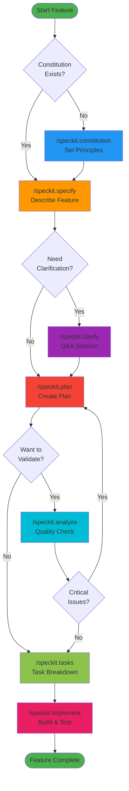
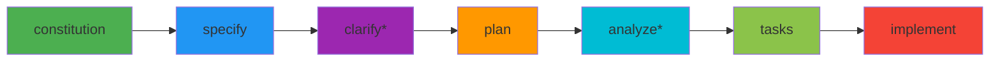
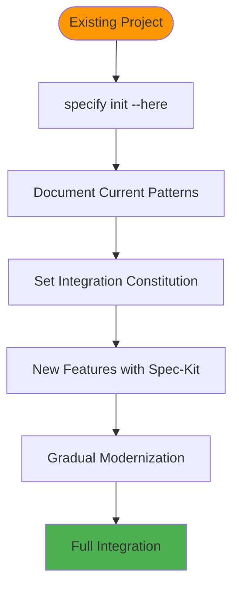
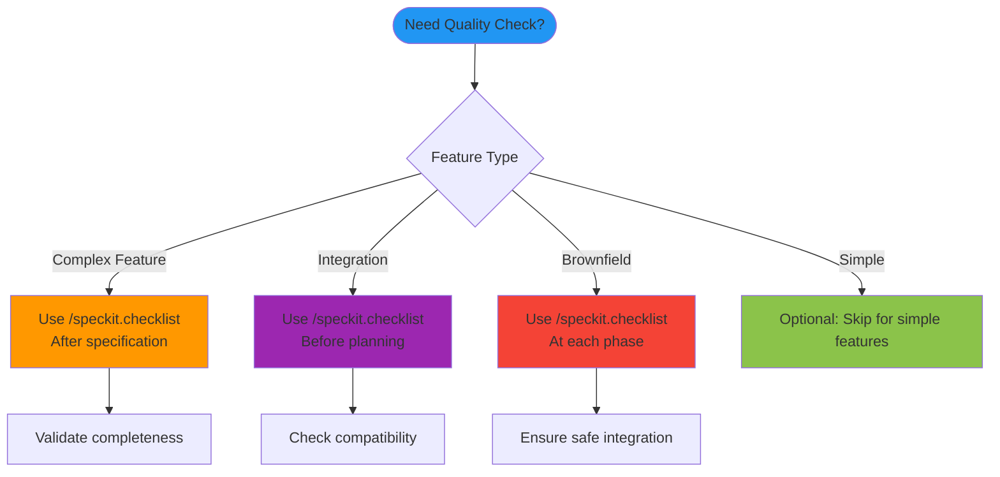
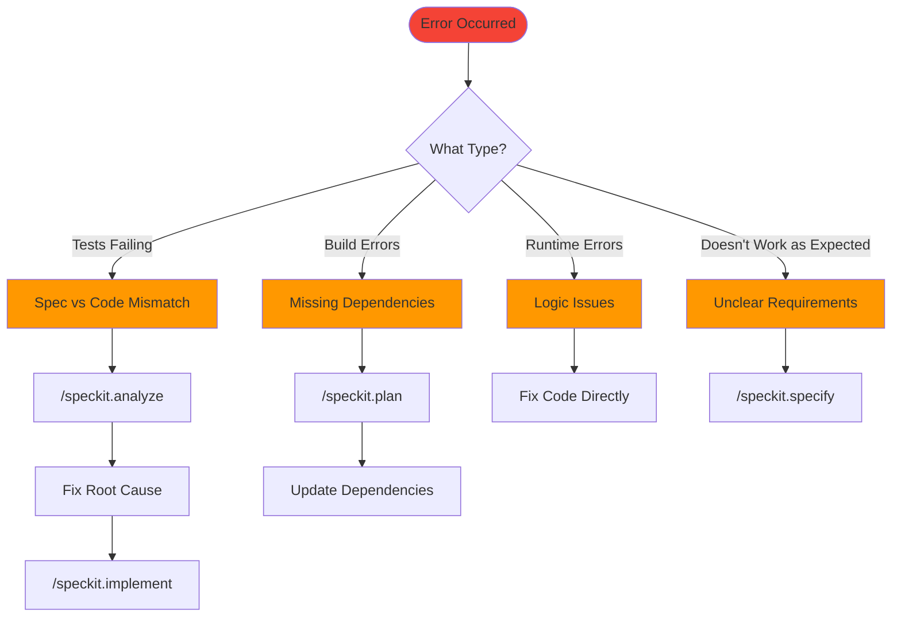
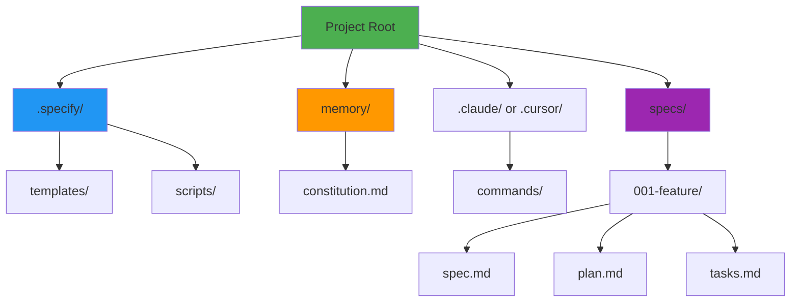

# Spec-Kit Quick Start Guide

> **Get started with GitHub Spec-Kit in minutes. Visual workflows, practical examples, and ready-to-use commands.**

---

## 🚀 5-Minute Quick Start

### Installation
```bash
# 1. Install uv
curl -LsSf https://astral.sh/uv/install.sh | sh

# 2. Install Spec-Kit (from official repository)
uv tool install specify-cli --from git+https://github.com/github/spec-kit.git

# 3. Initialize project
cd your-project
specify init --here

# Or initialize with specific AI agent
specify init --here --ai claude
specify init --here --ai cursor-agent
specify init --here --ai windsurf
```

### Your First Feature
```bash
# Set principles (once per project)
/speckit.constitution

# Build your feature
/speckit.specify "Add user authentication"
/speckit.plan
/speckit.tasks
/speckit.implement
```

**That's it!** Your feature is built with tests, documentation, and following best practices.

---

## 📊 Visual Workflow Overview

### Complete Development Flow



### Command Dependencies


*Optional steps

---

## 🎯 Core Commands

### 1. `/speckit.constitution` - Set Project Rules

**When**: Once per project  
**What**: Define your development principles

```
User: /speckit.constitution

AI: What are your key principles?
User: I want modular design, comprehensive testing, 
     and simple, maintainable code.

AI: [Creates constitution with your principles]
```

### 2. `/speckit.specify` - Describe What to Build

**When**: Starting any new feature  
**What**: Write detailed requirements

```
User: /speckit.specify "Add user authentication with email"

AI: I'll help you specify this feature:
1. What authentication method? (JWT, sessions?)
2. Password requirements?
3. Email verification needed?

User: JWT auth, 8+ char passwords, email verification required

AI: [Creates complete specification]
```

### 3. `/speckit.plan` - Create Technical Plan

**When**: After specification is complete  
**What**: Design the implementation

```
User: /speckit.plan

AI: What's your tech stack?
User: Node.js, Express, PostgreSQL, JWT

AI: [Creates architecture plan, API contracts, 
     database schema, testing strategy]
```

### 4. `/speckit.tasks` - Break Down Work

**When**: After planning is complete  
**What**: Create actionable task list

```
User: /speckit.tasks

AI: Generated 8 tasks:
1. [PARALLEL] Setup database schema
2. [PARALLEL] Create user model  
3. [DEPENDS: 1,2] Implement auth endpoints
4. [DEPENDS: 3] Add email verification
...
```

### 5. `/speckit.implement` - Build It

**When**: Tasks are ready  
**What**: Write code with TDD

```
User: /speckit.implement

AI: Executing tasks:
[1/8] Setup database schema
✅ Write tests (fail) → Implement schema → Tests pass → Commit

[2/8] Create user model
✅ Write tests (fail) → Implement model → Tests pass → Commit

...
[8/8] Complete ✅
```

---

## 🏗️ Brownfield Projects: Easy Integration

### Adding Spec-Kit to Existing Projects



### Quick Integration Steps

```bash
# 1. Initialize without touching existing code
cd your-existing-project
specify init --here

# 2. Document what you have
/speckit.constitution
# "Document current patterns, preserve existing APIs,
#  integrate gradually with new patterns"

# 3. Build NEW features with Spec-Kit
/speckit.specify "New feature using modern patterns"
# "Follow new patterns but integrate with existing systems"

# 4. Gradually modernize existing code
/speckit.specify "Modernize auth module"
# "Maintain backward compatibility, provide migration path"
```

### Brownfield Checklist Usage

**Use `/speckit.checklist` when:**

- 🔄 **Before Integration**: Ensure compatibility with existing systems
- 🔧 **During Modernization**: Verify legacy behavior is preserved  
- 🚀 **Before Deployment**: Confirm rollback procedures are ready

```bash
/speckit.checklist
# Generates integration-specific checklist:
# ✅ Are existing API contracts maintained?
# ✅ Is backward compatibility ensured?
# ✅ Are migration scripts tested?
# ✅ Is performance impact assessed?
```

---

## ✅ When to Use Checklists

### Decision Tree



### Checklist Examples

#### For Complex Features
```bash
/speckit.checklist
# Generated checklist:
# - [ ] Are all user roles defined?
# - [ ] Are success criteria measurable?
# - [ ] Are error scenarios documented?
# - [ ] Are performance requirements specified?
# - [ ] Are security requirements addressed?
```

#### For Integration Projects
```bash
/speckit.checklist
# Generated checklist:
# - [ ] Are existing API contracts maintained?
# - [ ] Is backward compatibility ensured?
# - [ ] Are data migrations validated?
# - [ ] Are rollback procedures tested?
```

---

## 🔄 Error Recovery: What to Do When Things Break

### Error Type Detection



### Quick Recovery Commands

```bash
# Tests failing?
/speckit.analyze
# Review findings → Fix spec or plan → /speckit.implement

# Build errors?  
/speckit.plan
# Add missing dependencies → /speckit.tasks → /speckit.implement

# Requirements unclear?
/speckit.clarify
# Answer questions → /speckit.specify → /speckit.plan

# Constitutional violations?
/speckit.analyze
# Fix violations → /speckit.plan → /speckit.implement
```

---

## 📁 Project Structure

### What Gets Created



### Key Files

| File | Purpose |
|------|---------|
| `memory/constitution.md` | Your project principles |
| `specs/NNN-feature/spec.md` | Feature requirements |
| `specs/NNN-feature/plan.md` | Technical design |
| `specs/NNN-feature/tasks.md` | Implementation steps |
| `.specify/templates/` | Customizable templates |

---

## 🎯 Common Scenarios

### Scenario 1: New Web Application

```bash
# 1. Start fresh
mkdir my-web-app
cd my-web-app
specify init --here

# 2. Set web app principles
/speckit.constitution
# "RESTful API, React frontend, PostgreSQL, 
#  comprehensive testing, JWT authentication"

# 3. Build first feature
/speckit.specify "User registration and login"
/speckit.plan
/speckit.tasks
/speckit.implement
```

### Scenario 2: Adding Feature to Existing Project

```bash
# 1. Go to existing project
cd existing-project

# 2. Initialize Spec-Kit (safe - won't change existing code)
specify init --here

# 3. Document current patterns
/speckit.constitution
# "Current: Express.js, MongoDB, existing auth system.
#  New: Follow existing patterns, maintain compatibility."

# 4. Add new feature
/speckit.specify "Add user notifications"
# "Integrate with existing user system, use current database"
```

### Scenario 3: Microservices Project

```bash
# 1. Set microservices constitution
/speckit.constitution
# "Service-first design, API communication, Docker deployment,
#  independent databases, service discovery"

# 2. Specify first service
/speckit.specify "User service with authentication"
# "Standalone service, REST API, PostgreSQL database"

# 3. Plan service architecture
/speckit.plan
# "Docker container, Express.js, separate database,
#  JWT tokens, health check endpoints"
```

---

## ⚡ Pro Tips

### DO ✅
- Run `/speckit.constitution` once at project start
- Be detailed in `/speckit.specify` - more detail = better results
- Always run `/speckit.plan` before implementing
- Use `/speckit.analyze` to catch issues early
- Review generated files before proceeding

### DON'T ❌  
- Skip the constitution - it prevents technical debt
- Rush through specification - be thorough
- Ignore analysis warnings - they prevent future problems
- Edit generated task files manually
- Override constitutional principles without good reason

### Best Practices

```bash
# Before any implementation
/speckit.analyze  # Always validate first

# During implementation  
/speckit.checklist  # Use checklists for quality

# After errors occur
/speckit.analyze  # Find root cause, don't just patch symptoms
```

---

## 🔧 Quick Reference

### Command Cheat Sheet

| Command | Purpose | When to Use |
|---------|---------|-------------|
| `/speckit.constitution` | Set project principles | Project start |
| `/speckit.specify` | Write feature specification | New feature |
| `/speckit.clarify` | Resolve ambiguities | Unclear requirements |
| `/speckit.checklist` | Generate quality checklist | Complex features |
| `/speckit.plan` | Create technical plan | After spec |
| `/speckit.analyze` | Validate artifacts | Before implementation |
| `/speckit.tasks` | Generate task list | After planning |
| `/speckit.implement` | Build the feature | Ready to code |

### Available AI Agents

```bash
# Initialize with your preferred AI agent:
specify init --here --ai claude          # Claude Code
specify init --here --ai cursor-agent   # Cursor Agent
specify init --here --ai windsurf        # Windsurf
specify init --here --ai gemini          # Gemini CLI
specify init --here --ai copilot         # GitHub Copilot
# ... and 10+ more supported agents
```

### File Locations

```
your-project/
├── memory/constitution.md          # Project principles
├── specs/001-feature/
│   ├── spec.md                     # Requirements
│   ├── plan.md                     # Technical design
│   └── tasks.md                    # Implementation steps
└── .specify/                       # Configuration (don't edit)
```

### Error → Action Map

```
Test failures          → /speckit.analyze → Fix root cause
Build errors           → /speckit.plan → Update dependencies
Unclear requirements   → /speckit.clarify → Answer questions
Design flaws           → /speckit.plan → Revise architecture
Integration issues     → Check contracts → Update plan
```

---

## 🎉 You're Ready!

### Your First Workflow

```bash
# 1. Install and initialize
uv tool install specify-cli
cd your-project
specify init --here

# 2. Set your principles  
/speckit.constitution

# 3. Build something amazing
/speckit.specify "Your feature idea"
/speckit.plan
/speckit.tasks  
/speckit.implement

# 🎉 Feature complete with tests, docs, and best practices!
```

### Need More Detail?

- 📖 **Comprehensive Guide**: `spec-kit-comprehensive-guide.md`
- 🐛 **Error Recovery**: See Error Recovery section above
- 🏗️ **Brownfield Integration**: See Brownfield Projects section
- ✅ **Quality Checklists**: Use `/speckit.checklist` at any time

---

## 📚 Learn More

### Official Resources
- **GitHub Spec-Kit**: https://github.com/github/spec-kit
- **Official Docs**: Repository README.md
- **Spec-Driven Development**: spec-driven.md

### Community
- **Issues**: Report bugs and request features
- **Discussions**: Ask questions and share experiences
- **Contributing**: Help improve the project

---

**Happy coding with Spec-Kit!** 🚀

Transform your development process from code-first to spec-first, and build better software faster.

---

*Last Updated: 2025 | Version: Latest | License: MIT*
